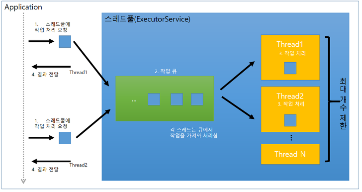
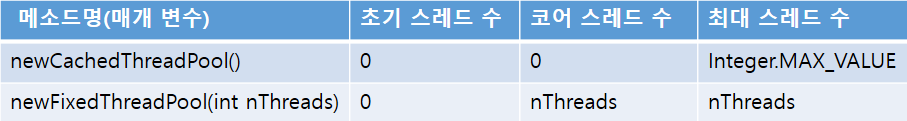
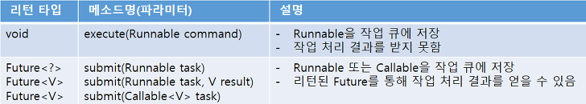
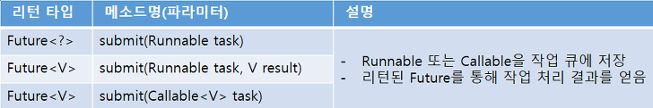
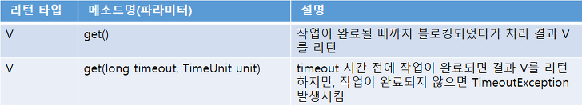
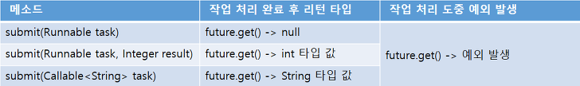
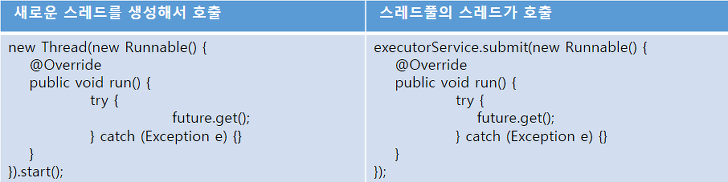
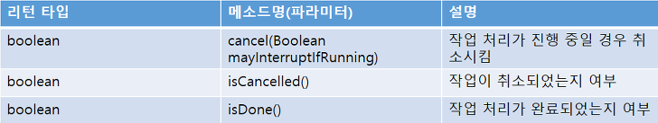

<h1>Thread Pool</h1>
<h1>Thread Pool</h1>
병렬 작업 처리가 많아지면 스레드의 갯수가 증가하고 그에 따른 <strong>스레드 생성과 스케줄링</strong>으로 인해 CPU가 바빠지고 메모리 사용량이 늘어난다.
따라서 애플리케이션의 성능이 저하된다.
 
 
<strong>따라서 갑자스러운 병렬 작업의 폭증으로 인한 스레드의 폭증을 막으려면 스레드풀(ThreadPool)을 사용해야한다.</strong>
 

- 스레드풀은 작업 처리에 사용되는 스레드를 제한된 갯수만큼 정해놓는다.
- 작업 큐(Queue)에 들어오는 작업들을 하나씩 스레드가 맡아 처리한다.
- 작업 처리가 끝난 스레드는 다시 작업 큐에서 새로운 작업을 가져와 처리한다.
- 따라서 작업 처리 요청이 폭증되어도 스레드의 전체 개수가 늘어나지 않으므로 애플리케이션의 성능이 급격하게 저하되지 않는다.
 

자바는 스레드풀을 사용할 수 있도록 java.util.concurrent 패키지의 ExecutorService 인터페이스와 Executors 클래스를 제공한다.
Executors의 다양한 팩토리 메소드를 이용해서 ExecutorService 구현 객체를 만들 수 있는데 이게 스레드 풀이다.

<h2>스레드풀 생성 및 종료</h2>

<h3>스레드풀 생성</h3>

ExecutorService 구현 객체는 Executors 클래스의 다음 두 가지 메소드를 이용해서 간편하게 생성 가능
 

- 초기 스레드 수 : ExecutorService 객체가 생성될 때 기본적으로 생성되는 스레드 수
- 코어 스레드 수 : 스레드 수가 증가된 후 사용되지 않는 스레드를 스레드풀에서 제거할 때 최소한 유지해야할 스레드 수
- 최대 스레드 수 : 스레드풀에서 관리하는 최대 스레드 수

~~~
ExecutorService executorService = Executors.newCachedThreadPool();
~~~
둘 다 스레드 갯수보다 작업 갯수가 많으면 새 스레드를 생성해서 작업을 처리한다.

newCachedThreadPool() 메소드로 생성된 스레드풀은 이론적으로는 int값이 가질 수 있는 최댓값만큼 스레드가 추가되지만, OS의 성능과 상황에 따라 달라진다.
<strong>1개 이상의 스레드가 추가되었을 경우 60초 동안 추가된 스레드가 아무 작업을 하지 않으면 추가된 스레드를 종료하고 풀에서 제거한다.</strong>
 
 

~~~
ExecutorService executorService = Executors.newFixedThreadPool(
    Runtime.getRuntime().availableProcessors() // CPU코어의 수만큼 최대 스레드를 사용하는 스레드풀을 생성한다.
);
~~~

newFixedThreadPool(int nThreads) 메소드로 생성된 스레드풀은 <strong>스레드가 작업을 처리하지 않고 놀고 있더라도 스레드 갯수가 줄어들지 않는다.</strong>

 
 
직업 코어 스레드 갯수와 최대 스레드 갯수를 설정하고 싶다면 직접 ThreadPoolExecutor 객체를 생성하면 된다. 
다음은 초기 스레드 갯수가 0개, 코어 스레드 갯수가 3개, 최대 스레드 갯수가 100개인 스레드풀을 생성한다. 그리고 코어 스레드 갯수 3개를 제외한 나머지 추가된 스레드가 120초동안 놀고있을 경우
해당 스레드를 제거해서 스레드 수를 관리한다.

~~~
ExecutorService executorService = new ThreadPoolExecutor(
    3,      //코어 스레드 개수
    100,    //최대 스레드 개수
    120L,   //놀고 있는 시간
    TimeUnit.SECONDS,   //놀고 있는 시간 단위
    new SynchronousQueue<Runnable>() //작업 큐
)
~~~

<h3>스레드풀 종료</h3>

<strong>스레드풀의 스레드는 기본적으로 데몬 스레드가 아니기 때문에 main 스레드가 종료도더라도 작업을 처리하기 위해 계속 실행 상태로 남아있는다.</strong>
애플리케이션을 종료하려면 스레드풀을 종료시켜 스레드들이 종료상태가 되도록 처리해야 한다. 

- shutdown() : 남아있는 작업을 마무리하고 스레드풀을 종료할 때 사용.
- shutdownNow() : 남아있는 작업과 상관없이 강제로 종료할 때 사용.

<h2>작업의 생성과 처리 요청</h2>

<h3>작업 생성</h3>
하나의 작업은 Runnable 혹은 Callable 구현 클래스로 표현한다. Runnable과 Callable의 차이점은 작업 처리 완료 후 리턴값이 있느냐 없느냐이다.
스레드풀의 스레드는 작업 큐에서 Runnable 또는 Callable 객체를 가져와 run()과 call() 메소드를 실행한다.

<strong>Runnable 구현 클래스</strong>

~~~
Ruunable task = new Runnable() {
    @Override
    public void run() {
        //스레드가 처리할 작업 내용
    }
}

Callable<T> task = new Callable<T>() {
    @Override
    public T call() throws Exception {
        //스레드가 처리할 내용
        return T;
    }
}
~~~

<h3>작업 처리 요청</h3>
작업 처리 요청이란
<strong>ExecutorService의 작업 큐에 Runnable / Callable 객체를 넣는 행위</strong>를 말한다.
ExecutorService는 작업 처리 요청을 위해 다음 두 가지 종류의 메소드를 요청한다.
 

<h4> execute() vs submit() </h4>
<strong>execute()</strong>

- 작업 처리 결과를 받지 못한다.
- 작업 처리 도중 예외가 발생하면 스레드가 종료되고, 해당 스레드는 스레드풀에서 제거된다. 따라서 스레드 풀은 다른 작업 처리를 위해 새로운 스레드를 생성한다.

<strong>submit()</strong>

- 작업 처리결과를 받을 수 있도록 Future을 리턴한다.
- 작업 처리 도중 예외가 발생하더라도 스레드는 종료되지 않고 다음 작업을 위해 재사용된다.

 
<strong>따라서 오버헤드를 줄이기 위해서 가급적이면 submit()을 사용하는게 좋다.</strong>

 
 
<strong>[ExecutorExample.java] execute() 메소드로 작업 처리 요청한 경우</strong>

~~~
public class ExecuteExample {
    public static void main(String[] args) {
        ExecutorService executorService = Executors.newFixedThreadPool(@); // 최대 스레드 갯수가 2인 스레드풀 생성

        for(int i = 0; i < 10; ++i) {
            Runnable runnable = new Runnable() {
                @Override
                public void run() {
                    //스레드 총 갯수 및 작업 스레드 이름 출력
                    ThreadPoolExecutor threadPoolExecutor = (ThreadPoolExecutor) executorService;
                    
                    int poolSize = threadPoolExecutor.getPoolSize();
                    String threadName = Thread.currentThread().getName();

                    System.out.println("[총 스레드 갯수 : " + poolSize + "] 작업 스레드 이름 : " + threadName);
                    int value = Integer.parseInt("삼"); //예외 발생 시킴
                }
            };

            executorService.execute(runnable);
            //executorService.submit(runnable);

            Thread.sleep(10);
        }

        executorService.shutdown();
    }
}
~~~

<h2>블로킹 방식의 작업 완료 통보</h2>

ExecutorService의 submit()메소드는 매개값으로 준 Runnable / Callable 작업을 스레드 풀의 작업 큐에 저장하고 즉시 Future 객체를 리턴한다.

<strong>Future 객체는 작업 결과가 아니라 작업이 완료될 때까지 기다렸다가(==지연했다가==블로킹되었다가) 최종결과를 얻는데 사용된다. Future의 get()메소드를 호출하면
스레드가 작업을 완료할때까지 블로킹 되었다가 작업을 완료하면 처리 결과를 리턴한다.</strong>

V(return type) : submit(Runnable task, V result) /  submit(Callable<V> task)

다음은 Future의 get() 메소드가 리턴하는 값에 대한 예시다

Future을 이용한 블로킹 방식의 작업 완료 통보에서 주의할 점은 작업을 처리하는 스레드가 작업을 완료하기 전까지는 get() 메소드가 블로킹되므로 다른 코드를 실행할 수 없다.
따라서 get() 메소드를 호출하는 스레드는 새로운 스레드이거나 스레드풀의 또 다른 스레드가 되어야 한다.

그 이외의 Future 객체가 제공하는 메소드

- cancel() 메소드 : 작업을 취소하고 싶은 경우 호출
  - 작업이 시작되기 전 : mayInterruptRunning 매개값과 상관없이 작업 취소 후 true 리턴
  - 작업이 진행 중 : mayInterruptRunning이 true일 경우에만 작업스레드를 interrupt
  - 작업이 완료 / 어떤 이유로 취소 불가 : false 리턴

- isCanacelled() : 작업이 완료되기 전에 작업이 취소되었을 경우에만 true 리턴
  isDone() : 작업이 정상적, 예외, 취소 등 어떤 이유에서건 작업이 완료되었다면 true 리턴

