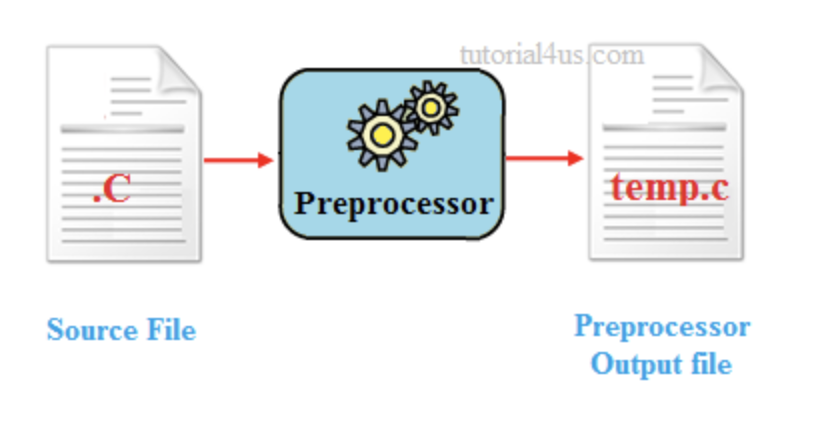
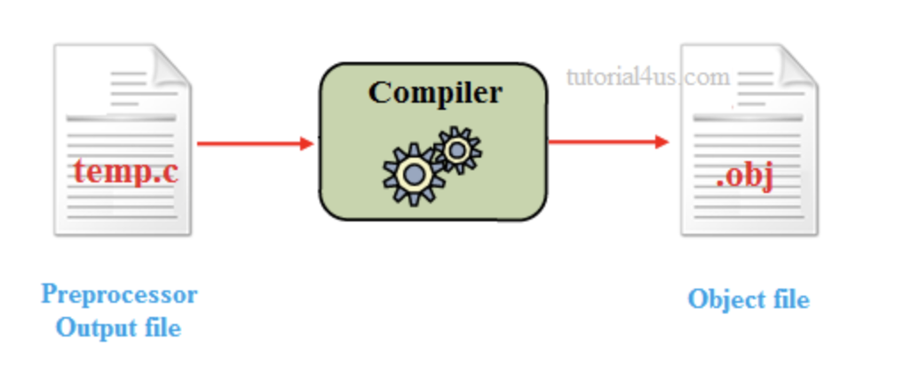
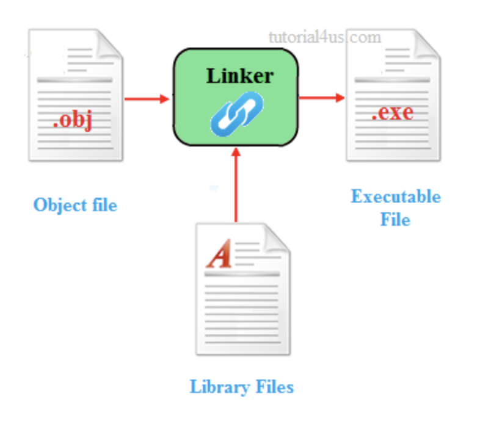
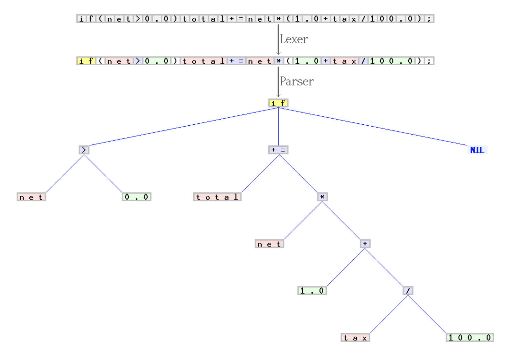
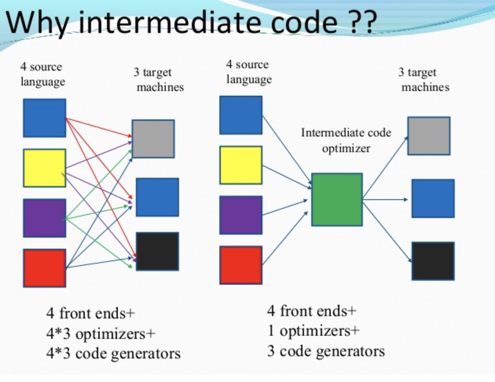

<h1>Compile</h1>

- 전통적인 컴파일: 어떤 언어로 된 소스 코드를 기계가 인식할 수 있는 네이티브 코드로 변환하는 과정
- 자바에서의 컴파일: 자바 언어로 된 코드를 JVM이 인식할 수 있는 JVM 명령어 코드(바이트 코드)로 변환하는 것.
**드물지만 자바에서의 컴파일도 일반적인 의미의 컴파일처럼 기계가 인식할 수 있는 코드로 변환하는 과정을 의미할 때도 있다. 대표적으로 JIT 컴파일러가 하는 컴파일은 바이트 코드로 변환하는 것이 아니라 바이트코드를 네이티브 토드로 변환하는 것을 의미한다.**

<h2>실행 파일 생성 과정</h2>

자바 소스 코드를 컴파일하는 과정이 몇 단계로 구성되는지 구체적으로 스펙에 규정되어 있지는 않다. C로 작성된 코드로부터 실행파일을 만드는 과정은 보통 다음과 같이 4단계로 구분한다.

1. 전처리(Preprocessing)

- 주석 제거
- 매크로 인라인화
- include 파일 인라인화

<strong>자바는 전처리 과정에서 주석이 있던 행 자체가 제거되지는 않는다. 바이트코드 내용 중에 자바 소스코드의 행 번호와 바이트코드 명령어의 위치를 매핑해주는 부분이 있는데 이 떄 표시되는 자바 소스 코드 행 번호는 주석이 있던 행이 제거되지 않은 상태 기준의 행 번호가 표시된다.</strong>

2. 컴파일(Compiling)

- 컴파일러가 전처리 과정을 거친 C 소스 코드를 컴파일해서 어셈블리어 코드로 변환

3. 어셈블리(Assembly)

- 어셈블러가 어셈블리어 코드를 기계어 코드로 변환

4. 링크(Linking)

- 링커가 기계어 코드와 공유 라이브러리 등 다른 코드를 합쳐서 최종 실행 파일 생성

<strong>자바는 컴파일 결과로 나온 바이트코드가 JVM이 실행되면서 네이티브 기계어 코드로 변환되므로, 프로그램 실행 전에 네이티브 기계어 코드를 만들어내는 어셈블리 단계가 없다고 볼 수 있다. 마찬가지로 링크 단계도 프로그램 실행 전에 수행되지 않고 JVM에 의해 동적 링킹이 수행된다.</strong>

<h2>컴파일 세부 단계</h2>

<h3>1. Lexical Analysis(어휘 분석)</h3>

Lexical Analyzer가 소스 코드에서 문자 단위로 읽어서 어휘소(lexeme)를 식별하고 어휘소를 설명하는 토큰 스트림(Token stream)을 생성한다. 어휘소는 식별가능한 문자 시퀀스인데 다음과 같은 것들을 통칭한다.

- 키워드(keywords): public, class, main, for etc
- 리터럴(literals): 1L, 2.3f, "Hello" etc
- 식별자(identifiers): 변수 이름, 상수 이름, 함수 이름 etc
- 연산자(operators): +, -, * etc
- 구분 문자(punctuation characters): ,, [], (), {} etc

토큰은 타입(키워드, 리터럴, 식별자 등)과 값(public, 1L, main)으로 구성되며(map처럼) 어휘소를 설명하는 객체로 볼 수 있다. 식별자 토큰은 어휘 분석 단계에서 심볼 테이블에 저장되고 이후 단계에서 계속 사용된다.

<h3>2. Syntax Analysis(구문 분석)</h3>

Syntax Analyzer(구문 분석기, 파서(Parser)라고도 한다.)가 어휘 분석 결과로 나온 토큰 스트름이 언어의 스펙으로 전해진 문법 형식에 맞는지 검사해서, 맞지 않으면 컴파일 에러를 내고, 맞으면 Parse Tree를 생성한다.(구문 분석 단계의 결과로 나오는 파스 트리를 추상 구문 트리라고도 한다.)

<h3>3. Symantic Analysis(의미 분석)</h3>

의미 분석 단계에서는 타입 검사, 자동 타입 변환 등이 수행된다. 예를 들어 다음과 같은 코드는 구문 분석 단계에서는 에러가 나지 않지만, 의미 분석 단계에서는 타입 검사가 수행되면서 에러가 발생한다.

~~~
int a = "Hello";
~~~

의미 분석 단계를 거치면서 파스 트리에 타입 관련 정보 등이 추가된다.

<h3>4. Intermediate Code Generation(중간 코드 생성</h3>

의미 분석 단계를 통과한 파스 트리를 바탕으로 기계어로 변환하기 좋은 형태의 중간 언어로 된 중간 코드를 생성한다. 중간 코드를 만들어 사용하는 이유는 중간 언어가 없을 때의 문제점을 그림으로 보면 금방 이해가된다.

한 마디로 중간 단계를 하나 둬서 간접화를 통해 경우의 수를 낮추고 효율을 높기이 위해 중간 코드를 생성한다. <strong>자바의 경우 바이트코드가 바로 이 중간 코드에 해당한다고 볼 수 있다. 위 그림에서 4개의 언어를 나타내는 네모를 각각 자바, 클로저(Clojure), 스칼라, 코틀린이라고 하고 녹색 네모를 바이트코드라고 생각하면 쉽게 이해할 수 있다.</strong>

<strong>어휘 분석에서 만들어져서 구문 분석, 의미 분석 과정을 거치며 다듬어진 심볼 테이블은 중간 코드인 바이트코드 생성 단계에서 클래스나 인터페이스별 상수 풀(Constant pool)을 만드는데 사용된다.</strong>

- 상수 풀 안에 담겨 있는 대부분의 자료구조는 이름, 설명자(Descriptor), 값 등 테이블에 정적으로 저장된 정보를 조합해서 엔티티를 표현하지만, CONTANT_Dynamic_info, CONSTANT_InvokeDynamic_info로 표현되는 자료구조는 런타임에 정해지는 동적인 엔티팉를 간접적으로 표현한다.
- 상수 풀에 저장된 정보는 클래스나 인터페이스가 실제로 생성될 때, 런타임 상수 풀(Runtime Constant Pool)을 구성하는데 사용된다.

<h3>5. Code Optimization(중간 코드 최적화)</h3>
중간 코드가 더 효율적인 기계어로 변환되도록 최적화하는 과정이 수행된다.

1. 핍홀(Peephole) 최적화
   - 중복 명령어 제거
   - 도달 불가능한 코드 제거
   - 제어 흐름 최적화
   - 비용 낮은 연산자로 변환 등

2. 지역 최적화
   - 지역 공통 부분식 제거
   - 복사 전파
   - 상수 폴딩 등

3. 루프 최적화
   - 코드 이동
   - 귀납 변수 최적화
   - 루프 융합/교환/전개 등

4. 전역 최적화
   - 전역 공통 부분식 제거
   - 상수 폴딩 등

<h2>컴파일 과정 정리</h2>
자바의 컴파일 과정을 한 마디로 요약하면 자바 코드를 자바 언어 스펙에 따라 분석/검증하고 JVM 스펙의 class 파일 구조에 맞는 바이트 코드를 만들어내는 과정이라고 할 수 있다. 바이트 코드는 JVM에서 실행될 수 있는 코드다. 따라서 꼭 자바가 아니더라고 JVM 스펙의 class 파일 구조에 맞는 바이트 코드를 만들어 낼 수 있다면 어떤 언어든 JVM에서 실행할 수 있다. Clojure나 Salar, Kotlin이 JVM에서 실행될 수 있는 이유도 여기에 있다.

