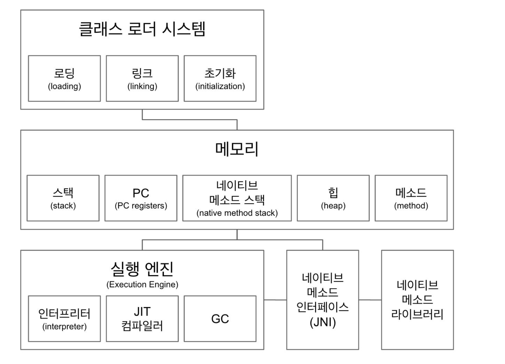
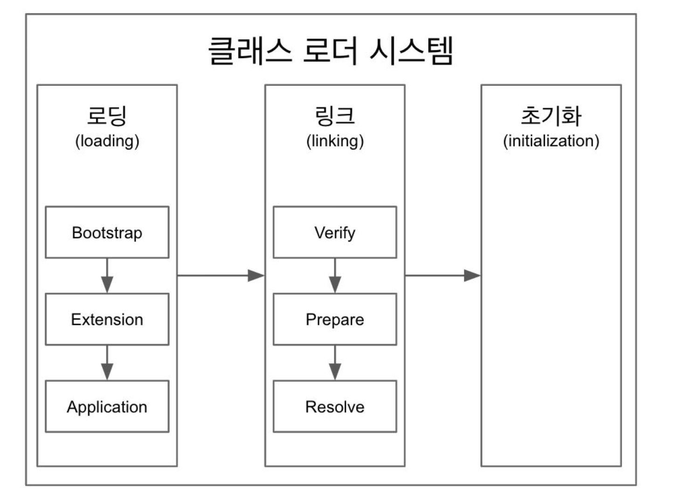

<h1>JVM 구조</h1>

프로그램이 실행되면, JVM은 OS로부터 메모리를 할당받고, JVM은 이 메모리를 용도에 따라 여러 영역으로 나눠서 관리한다.

- Class Loader System: 클래스 파일을 로딩한 뒤 검증하고 초기화하는 영역
- Runtime Data Area: Method Area, Heap, Java stack, pr registers, native method stacks 5개 영역으로 나뉜다.
- Execution Engine: 클레스 파일을(바이트 코드) 플랫폼에 맞게 기계어로 변환시켜 실행하는 Execution engine

<h2>Class Loader</h2>

- 로딩, 링킹, 초기화 순으로 진행된다.
  1. 로딩
   - 클래스 로더가 .class 파일을 읽고 그 내용에 따라 적절한 바이너리 데이터를 만들고 "메소드"영역에 저장.
   - 이때 메소드 영역에 저장하는 데이터
     - FQCN(Fully Qualified Class Name)
     - class, interface, enum
     - 메소드와 변수
   - 링크
     - Verify, Prepare, Resolve(Optional) 세 단계로 나뉜다.
       - Verify: .class파일 형식이 유효한지 체크한다.
       - Preparation: 클래스 변수(static 변수)와 기본값에 필요한 메모리를 할당한다.
       - Resolve: 심블록 메모리 레퍼런스를 메소드 영역에 있는 실제 레퍼런스로 교체한다.
   - 초기화
     - static 변수의 값을 할당한다.(static 블록이 있다면 이때 할당된다.)

- 클래스 로더는 계층 구조로 이뤄져 있으며, 기본적으로 세가지 클래스 로더가 제공된다.
  - 부트 스트랩 클래스 로더: Java_HOME\lib에 있는 코어 자바 API를 제공한다. 최상위 우선순위를 가진 클래스 로더
  - 플랫폼 클래스 로더: JAVA_HOME\lib\ext 폴더 또는 java.ext.dirs 시스템 변수에 해당하는 위치에 있는 클래스 로더
  - 애플리케이션 클래스로더: 애플리케이션 클래스패스(애플리케이션 실행할 때 주는 -classpath 옵션 또는 java.class.path 환경 변수의 값에 해당하는 위치)에서 클래스를 읽는다.

 
 

<strong>대부분의 클래스는 애플리케이션 클래스 로더가 로딩한다. 애플리케이션 클래스 로더는 플랫폼 클래스 로더가 로딩하고, 플랫폼 클래스 로더는 부트스트랩 클래스로더가 로딩하고, 부트스트랩 클래스 로더는 java 명령에 의해 JRE가 조성될 때 실행된다.</strong>

<h2>Execution Engine</h2>

<strong>Laod된 Class의 ByteCode를 실행하는 Runtime Module이 바로 Execution Engine이다. Class Loader를 통해 JVM 내의 Runtime Data Areas에 배치된 바이트 코드는 Execution Engine에 의해 실행된다. 실행 엔진은 자바 바이트 코드를 명령어 단위로 읽어서 실행한다.</strong> 최초 JVM이 나왔을 당시에는 Interpreter 방식이어서 속도가 느렸지만 JIT Compiler 방식을 도입해서 이 점을 보완했다. JIT는 ByteCode를 어셈블러 같은 Native Code로 바꿔서 실행이 빠르지만 이 역시 변환하는데 비용이 발생했고, 이 같은 이유로 JVM은 모든 코드를 JIT Compiler 방식으로 실행하지 않고 Interpreter 방식을 사용하다가 일정한 기준이 넘어가면 JIT Compiler 방식으로 실행한다.

1. Interpreter: 자바 바이트 코드를 명령어 단위로 읽어서 실행한다. 이 방식은 한줄 씩 수행하기 때문에 느리다는 단점이 있다.
2. JIT(Just In Time): 인터프리터의 단점을 보완하기 위해 도입한 것으로, 인터프리터 방식으로 실행하다가 적절한 시점에 바이트 코드 전체를 컴파일 하여 네이티브 코드로 변경해서 저장하고, 재사용 할 때 변환된 네이티브 코드를 재사용하는 방식. 초반에 메모리를 잡아 두거나 하는 작업들이 있어서 초기 실행속도는 느릴 수 있지만 이후로는 ByteCode를 사용할 때마다 네이티브 코드로 변환하는 작업이 들어 실행속도가 많이 향상된다.

<h2>Runtime Data Area</h2>

JVM이 프로그램을 수행하기 위해 OS로부터 별도로 할당받는 메모리 공간

1. <strong>PC Register:</strong> Thread마다 할당되는 공간이다. Thread가 어떤 명령을 실행해야할지를 기록하는 부분으로 현재 수행중인 JVM명령의 주소를 갖는다. 만약 Native Method를 수행한다면 PC Register는 undefined 상태가 된다. PC Register에 저장되는 Instruction의 주소는 Native Pointer일 수도 있고 Method ByteCode일수도 있다. Native Method를 수행한다면 JVM을 거치지 않고 API를 통해 바로 수행된다.

2. <strong>JVM stack:</strong> 일반 메모리에서 stack영역과 동일

3. <strong>Native Method Stack:</strong> Java외의 언어로 작성된 네이티브 코드들을 위한 Stack, 즉 JNI(Java Native Interface)를 통해 호출되는 C/C++등의 코드를 수행하기 위한 스택. 실제 실행할 수 있는 기계어로 작성된 프로그램을 실행시키는 영역이다.

4. <strong>Method Area(=Class Area = Static Area):</strong> 모든 스레드가 공유하는 영역. 
**클래스, 인터페이스, 메소드, 필드, static 변수 등의 바이트 코드 등을 보관한다.** 자바 프로그램은 main 메소드의 호출에서부터 계속된 메소드의 호출로 흐름을 이어가며, 대부분 인스턴스의 생성도 메소드 내에서 명령하고 호출한다. 사실상 컴파일된 바이트코드의 대부분이 메소드 바이트코드이기 때문에 거의 모든 바이트코드가 올라간다고 봐도 무방하다. <strong>이 공간에는 Runtime Constant Pool이라는 별도의 관리 영역도 함께 존재한다. 이는 상수 자료형을 저장하여 참조하고 중복을 막는 역할을 수행한다.</strong>

<h3>Method Area에 올라가는 정보의 종류</h3>

1. Field Information: 멤버 변수의 이름, 데이터 타입, 접근 제어자에 대한 정보
2. Method Information: 메소드의 이름, 리턴 타입, 매개변수 타입, 접근 제어자에 대한 정보
3. Type Information: Type 속성이 Class인지, Interface인지 여부 저장
   - FQCN
   - Type의 Super Class FQCN
   - 접근 제어자 및 연관된 Interface의 전체 리스트 저장
4. Constant Pool
   - Type에서 사용된 상수를 저장하는 곳(중복이 있을 시 기존의 상수 사용)
   - 문자 상수, 타입, 필드, Method의 Symbolic reference(객체 이름으로 참조하는 것)도 상수 풀에 저장.
5. Class variable: static 변수라고도 불림. 모든 객체가 공유할 수 있고, 객체 생성없이 접근 가능
6. Class 사용 이전에 메모리 할당. final class 변수(static final)변수의 경우 상수로 치환되어 상수풀에 복사된다.

<h2>Heap</h2>
- 객체를 저장하는 가상 메모리 공간. 프로그램 상에서 런타임시 동적으로 할당하여 사용하는 영역.
