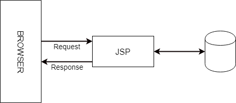
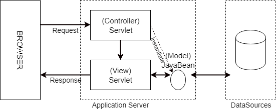
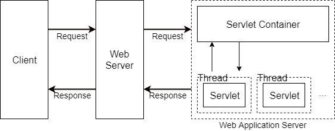
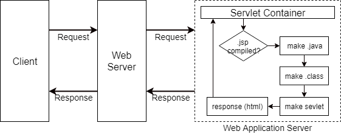
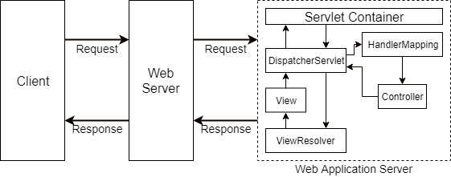

<h1>Servlet</h1>

- SUN사에서 제안한 웹 서비스를 위한 인터페이스로, 엄밀하게는 javax.servlet.Servlet 인터페이스의 구현체다. 
- 클라이언트의 요청을 처리하고 결과를 다시 클라이언트에게 전송하는 Servlet 인터페이스 구현 규칙에 맞게 작성된 자바 프로그램
- 일반적인 자바 독립 실행 프로그램과 달리 main 메소드가 없으며, 서블릿 컨테이너에 등록된 후 서블릿 컨테이너에 의해 생성, 호출, 소멸이 이루어진다.

<h3>MVC model1</h3>

View를 표현하는 HTML과 Model / Controller을 담당하는 코드가 JSP안에서 함께 작성되기 때문에 MVC의 각 컴포넌트의 분리를 통한 효과를 보기 힘들었다.

따라서 JSP는 JavaBean을 사용하여 데이터베이스에 접근하는 모델을 만들어 분리했고 이를 MVC1이라고 한다.

<h3>MVC model2</h3>

모델2에선 각 컴포넌트가 혼재되는 JSP와 HTML 표현 방법이 불편한 Servlet을 함께 사용하여 View와 Controller를 분리했다.

**실제로는 JSP도 Servlet으로 변환되서 실행된다.**

<h3>Servlet 동작 과정</h3>

서블릿 컨테이너는 URL 패턴과 서블릿을 매핑하는 배포 서술자(Deployment Descriptor, web.xml)을 사용해서 요청에 맞는 서블릿을 찾아 요청에 대한 처리를 위한 스레드를 생성해준다. Servlet Container로 tomcat이 있다.

1. 웹 서버로부터 요청이 들어오면 제일 먼저 컨테이너가 이를 전달바든ㄴ다.
2. 컨테이너는 배포서술자(web.xml)을 참조해서 해당 서블릿을 찾는다.
3. 서블릿이 존재하지 않으면 '메모리 로딩 -> 객체 생성 -> init()'과정이 발생한다.
4. 서블릿이 존재하면 스레드 풀을 사용해서 서블릿을 위한 스레드를 생성한다.
5. HttpServletRequest / HttpServletResponse 객체를 생성해서 서블릿에 전달한다.
6. 다음으로 컨테이너는 서블릿의 service() 메소드를 호출하고, service() 메소드 요청에 따라 doPost(), doGet()을 호출한다.
7. 호출된 doPost(), doGet()메소드는 생성된 동적페이지를 HttpServletResponse 객체에 실어서 컨테이너에 전달한다.
8. 컨테이너는 전달받은 HttpServletResponse 객체를 HttpResponse 형태로 전환해서 웹서버에 전달하고 생성된 스레드를 종료한다.
9. HttpServletRequest / HttpServletResponse 객체를 소멸시킨다.

<h3>JSP</h3>

JSP를 Servlet 클래스로 변환하는 역할을 Servlet Container의 JSP 엔진이 담당한다.

1. JSP 페이지로부터 요청을 받는다.
2. JSP 엔진에 의해 JSP 파일이 파싱된다.
3. JSP에 대응하는 Servlet이 존재하지 않는 경우 Servlet파일(.java)로 변환된다.
4. 변환된 Servlet파일이 자바 컴파일러에 의해 클래스 파일(.class)로 컴파일된다.
5. 컴파일 된 후 Servlet 클래스의 service() 메소드를 호출하고 요청을 처리한다.
변환된 Servlet 파일(.java)엔 JSP에서 작성된 자바 코드가 service() 메소드 안에 존재하기 때문에 자바로 생성된 로직을 수행할 수 있다.
<h2>Servlet Container</h2>
서블릿 컨테이너는 개발자가 웹 서버와 통신하기 위해서 소켓을 생성하고(socket()), 특정 포트에 리스팅하고(bind(), listen()), 스트림을 생성하는 등 복잡한 일들을 할 필요가 없게해준다. **컨테이너는 Servlet 생성부터 소멸까지의 일련의 과정(Life Cycle)을 관리한다. 서블릿 컨테이너는 요청이 들어올 때마다 새로운 자바 스레드를 만든다.** 우리가 알고있는 대표적인 Servlet Container가 Tomcat이다. 톰캣같은 WAS가 java를 컴파일해서 class파일로 만들고 이를 메모리에 올려 Servlet 객체를 만든다.

<h1>DispatcherServlet</h1>

DispatcherServlet은 모든 요청을 받음. 또한 특정 URL 패턴의 요청만 받도록 제한할 수 있다.

1. DispatcherServlet으로 Request가 들어온다.
2. DispatcherServlet은 해당 요청을 처리할 컨트롤러를 찾기 위해 HandlerMapping의 도움을 받는다.(컨트롤러를 등록할 때 XML, 자바 객체 모두 사용할 수 있으나 현재는 객체를 더 많이 사용하는 추세다.)
3. 핸들러 매핑에서 적당한 컨트롤러를 찾아서 매핑한다.
4. 요청을 수행할 컨트롤러에게 해당 요청에 대한 비즈니스 로직 기능을 수행하도록 지시한다.
5. 