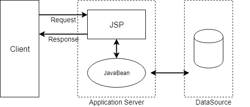

<h1>Servlet</h1>
 
- 서블릿 컨테이너는 웹 애플리케이션 서버중 HTTP 요청을 받아 처리하는 기초 역할을 맡고있다. 대부분의 웹 프레임워크가 제공하는 기능은 서블릿 컨테이너 위에서 동작하는 서블릿, 필터, 이벤트 리스너 등을 적절하게 구현한 것이다. 따라서 사용자가 웹 프레임워크로 작성한 웹 애플리케이션은 결국 서블릿 컨테이너 위에서 동작한다. 서블릿 컨테이너의 종류로는 아파치 톰캣, 제티 등이 서블릿 컨테이너로 널리 사용되고 있다. 일반적인 자바 독립 실행 프로그램과 달리 main 메소드가 없으며, 서블릿 컨테이너에 등록된 후 서블릿 컨테이너에 의해 생성, 호출, 소멸이 이루어진다.
- 서블릿 컨테이너에 의해 프로그램이 실행되기 위해서는 표준 즉 Servlet(SUN사에서 제안한 웹 서비스를 위한 인터페이스로)를 구현해줘야한다. **사용자 정의 서블릿은 서블릿 컨테이너 내에 등록된 후 서블릿 컨테이너에 의해 생성, 호출, 소멸이 이루어진다.**
- 때로는 서블릿은 자신의 상태 변경 시점을 알아내 적절한 리소스 획득 / 반환 등의 처리를 해야하므로 Servlet 인터페이스에 init / destroy 메소드가 정의된다. 다시 말해 서블릿 컨테이너는 서블릿의 생명 주기에 따라 서블릿의 상태를 변경하면서 서블릿 인터페이스에 정의된 각 메소드를 호출한다.
  - 1).Servlet: Servlet은 서블릿 프로그램을 개발할 때 반드시 구현해야 하는 메소드를 선언하고 있는 인터페이스다. **이 표준을 구현해야 서블릿 컨테이너가 해당 서블릿을 실행할 수 있다.**
  - 2). GenericServlet: GenericServlet은 Servlet 인터페이스를 상속하여 클라이언트-서버 환경에서 서버단의 애플리케이션으로서 필요한 기능을 구현한 추상 클래스다. service() 메소드를 제외한 모든 메소드를 재정의하여 적절한 기능으로 구현했다. GenericServlet 클래스를 상속하면 애플리케이션이 프로토콜에 따라 메소드 재정의 구문을 적용해야한다.
  - 3). HttpServlet: 일반적으로 Servlet이라고 하면 대부분 HttpServlet을 상속받은 Servlet을 의미한다. HttpServlet은 GenericServlet을 상속받았으며, GenericServlet의 유일한 추상 메소드인 service를 HTTP 프로토콜 요청 메소드에 적합하게 재구현해놨다.

<h3>HttpServlet과 MVC에 대해서</h3>

**HttpServlet을 상속하고 구현한 클래스들이 많은데 어떻게 요청된 URL에 따라 각각에 서블릿으로 보내줄 수 있을까?**

- web.xml 혹은 @WebServlet(서블릿 3.0부터 사용 가능) 어노테이션이다.
- 하지만 이 방식으로 url마다 모두 매핑해서 사용해야 한다면 유지보수, 확장성 등을 생각했을 때 비효율적이다. 그래서 한단계 더 진보한 것이 MVC 패턴이다.
- MVC 패턴에서는 FrontController 패턴을 이용해서 사용자 URL을 받는다. FrontController 패턴은 모든 클라이언트의 욫어을 최 앞단 FrontController에 두고 각각에 컨트롤러에 매핑해주는 방식이다.

------------------------------------

<h3>MVC model1</h3>

View를 표현하는 HTML과 Model / Controller을 담당하는 코드가 JSP안에서 함께 작성되기 때문에 MVC의 각 컴포넌트의 분리를 통한 효과를 보기 힘들었다.

따라서 JSP는 JavaBean을 사용하여 데이터베이스에 접근하는 모델을 만들어 분리했고 이를 MVC1이라고 한다.

<h3>MVC model2</h3>

모델2에선 각 컴포넌트가 혼재되는 JSP와 HTML 표현 방법이 불편한 Servlet을 함께 사용하여 View와 Controller를 분리했다.

**실제로는 JSP도 Servlet으로 변환되서 실행된다.**

<h3>Servlet 동작 과정</h3>

서블릿 컨테이너는 URL 패턴과 서블릿을 매핑하는 배포 서술자(Deployment Descriptor, web.xml)을 사용해서 요청에 맞는 서블릿을 찾아 요청에 대한 처리를 위한 스레드를 생성해준다. Servlet Container로 tomcat이 있다.

1. 웹 서버로부터 요청이 들어오면 제일 먼저 컨테이너가 이를 전달바든ㄴ다.
2. 컨테이너는 배포서술자(web.xml)을 참조해서 해당 서블릿을 찾는다.
3. 서블릿이 존재하지 않으면 '메모리 로딩 -> 객체 생성 -> init()'과정이 발생한다.
4. 서블릿이 존재하면 스레드 풀을 사용해서 서블릿을 위한 스레드를 생성한다.
5. HttpServletRequest / HttpServletResponse 객체를 생성해서 서블릿에 전달한다.
6. 다음으로 컨테이너는 서블릿의 service() 메소드를 호출하고, service() 메소드 요청에 따라 doPost(), doGet()을 호출한다.
7. 호출된 doPost(), doGet()메소드는 생성된 동적페이지를 HttpServletResponse 객체에 실어서 컨테이너에 전달한다.
8. 컨테이너는 전달받은 HttpServletResponse 객체를 HttpResponse 형태로 전환해서 웹서버에 전달하고 생성된 스레드를 종료한다.
9. HttpServletRequest / HttpServletResponse 객체를 소멸시킨다.

<h3>JSP</h3>

JSP를 Servlet 클래스로 변환하는 역할을 Servlet Container의 JSP 엔진이 담당한다.

1. JSP 페이지로부터 요청을 받는다.
2. JSP 엔진에 의해 JSP 파일이 파싱된다.
3. JSP에 대응하는 Servlet이 존재하지 않는 경우 Servlet파일(.java)로 변환된다.
4. 변환된 Servlet파일이 자바 컴파일러에 의해 클래스 파일(.class)로 컴파일된다.
5. 컴파일 된 후 Servlet 클래스의 service() 메소드를 호출하고 요청을 처리한다.
변환된 Servlet 파일(.java)엔 JSP에서 작성된 자바 코드가 service() 메소드 안에 존재하기 때문에 자바로 생성된 로직을 수행할 수 있다.
<h2>Servlet Container</h2>
서블릿 컨테이너는 개발자가 웹 서버와 통신하기 위해서 소켓을 생성하고(socket()), 특정 포트에 리스팅하고(bind(), listen()), 스트림을 생성하는 등 복잡한 일들을 할 필요가 없게해준다. **컨테이너는 Servlet 생성부터 소멸까지의 일련의 과정(Life Cycle)을 관리한다. 서블릿 컨테이너는 요청이 들어올 때마다 새로운 자바 스레드를 만든다.** 우리가 알고있는 대표적인 Servlet Container가 Tomcat이다. 톰캣같은 WAS가 java를 컴파일해서 class파일로 만들고 이를 메모리에 올려 Servlet 객체를 만든다.

<h2>DispatcherServlet</h2>

DispatcherServlet은 모든 요청을 받음. 또한 특정 URL 패턴의 요청만 받도록 제한할 수 있다.

<h3>스프링 부트 실행 과정</h3>
Spring boot는 ServletContainterInitializer를 구현한 TomcatStarter의 onStartup 메소드를 먼저 실행한다. 톰캣을 실행하고 다음 조건이 만족하면 DispatcherServlet이 등록된다. DispatcherServletAutoConfiguration.class에 구성되어 있는 DispatcherServlet이 빈 등록으로 자동 등록된다.

~~~
@Configutarion
@Conditional({DispatcherServletAutoConfiguration.DefaultDispatcherServletCondition.class})
@ConditionalOnClass({ServletRegistration.class})
@EnableConfigurationProperties({HttpServlet.class, WebMvcProperties.class})
protected static class DispatcherServletConfiguration {
    private final HttpProperties httpProperties;
    private final WebMvcProperties webMvcProperties;

    public DispatcherServletConfiguration(HttpProperties httpProperties, WebMvcproperties webMvcProperties) {
        this.httpProperties = httpProperties;
        this.webMvcProperties = webMvcProperties;
    }

    @Bean(name = {"dispatcherServlet})
    public DispatcherServlet dispatcherServlet() {
        DispatcherServlet dispatcherServlet = new DispatcherServlet();
        dispatcherServlet.setDispatchOptionRequest(this.webMvcProperties.isDispatchOptionsRequest());
        dispatcherServlet.setDispatchTraceRequest(this.webMvcProperties.isDispatchTraceRequest());
        dispatcherServlet.setThrowExceptionIfNotHandlerFound(this.webMvcProperties.isThrowExceptionIfNotHandlerFound());
        dispatcherServlet.setEnableLoggingRequestDetails(this.httpProperties.isLogRequestDetails());
        return dispatcherServlet;
    }

    @Bean
    @ConditionalOnBean({MultipartResolver.class})
    @ConditionallOnMissingBean(
        name = {"multipartResolver}
    )
    public MultipartResolver multipartResolver(MultipartResolver resolver) {
        return resolver;
    }
}
~~~

1. DispatcherServlet 서블릿이 스프링에 빈으로 등록된다.
2. 서블릿 컨테이너 컨텍스트에 서블릿을 등록한다.
3. 서블릿 컨테이너 필터에 등록설정 해놓은 필터들을 등록한다.
4. DispatcherServlet에 각종 핸들러 매핑(자원 URI)들이 등록된다. (컨트롤러 빈들이 다 생성되어 싱글톤으로 관리된다.)

<h3>클리이언트 요청으로부터 DispatcherServlet의 전체 흐름</h3>

Framework은 HttpServlet을 상속받고 있다. DispatcherServlet은 FrameworkServlet을 상속받고 있다. 즉 DispatcherServlet이 FrontController라는 것이다. **주의할 점은 서블릿 컨테이너처럼 요청이 왔을 때 객체를 생성하는게 아니라 이미 컨트롤러들이 빈으로 등록되어져 있다는 것을 생각해야한다.**

1. FrameworkServlet.service()를 먼저 탄다.
2. FrameworkServlet.service()는 dispatch.doService()를 호출한다.
3. dispatch.doService()는 dispatch.doDispatch()를 실행한다.
   - doDispatch는 AbstractHandlerMapping 매핑에서 핸들러(컨트롤러)를 가져온다.
   - 인터셉터 등을 지나서 해당 컨트롤러 메소드로 이동한다.
   - 해당 핸들러는 MV를 리턴한다.
   - @RestController 컨트롤러 같은 경우는 Converter를 이용해서 결과값을 바로 리턴한다.
   - 만약 View에 대한 정보가 있으면 ViewResolver에 들려 뷰 객체를 얻는다.
   - 뷰를 통해 렌더링한다.

<h2>스프링 웹 애플리케이션의 동작 원리</h2>

1. 웹 애플리케이션이 실행되면 Tomcat(WAS)에 의해 web.xml이 로딩된다. (load-on-startup으로 톰캣 시작시 servlet 생성 가능하도록 설정 가능)
2. web.xml에 등록되어 있는 ContextLoaderListener(Java class)가 생성된다. ContextLoaderListener 클래스는 ServletContextLister 인터페이스를 구현하고 있으며, ApplicationContext를 생성하는 역할을 수행한다.
3. 생성된 ContextLoaderListener 는 application.xml을 로딩한다.
4. applicationContext.xml에 등록되어 있는 설정에 따라 Spring Container가 구동된다. **이때 개발자가 작성한 비즈니스 로직에 대한 부분과 DAO, VO 객체들이 생성된다.**
5. 클라이언트로부터 웹 어플리케이션 요청이 온다.
6. DispatcherServlet(Servlet)이 생성된다. (DispatcherServlet은 FrontController의 역할을 수행한다. 클라이언트로부터 요청온 메세지를 분석하여 알맞은 PageController에 전달하고 응답을 받아 요청에 따른 응답을 어떻게 할지 결정만 한다. 실질적인 작업은 PageController(HandlerMapping, ViewResoler etc)에서 이뤄지기 때문이다.)
7. **DispatcherServlet은 servlet-context.xml(spring-mvc.xml)을 로딩한다.**
8. 두 번째 Spring Container가 구동되면 응답에 맞는 PageController가 구동되면 응답에 맞는 PageController들이 동작한다. 이때 첫번째 Spring Container가 구동되면서 생성된 DAO, VO, ServiceImpl 클래스들과 협업하며 알맞은 작업을 처리하게 된다.
