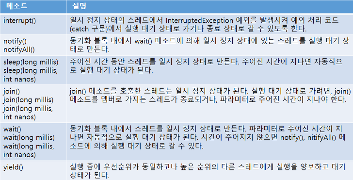
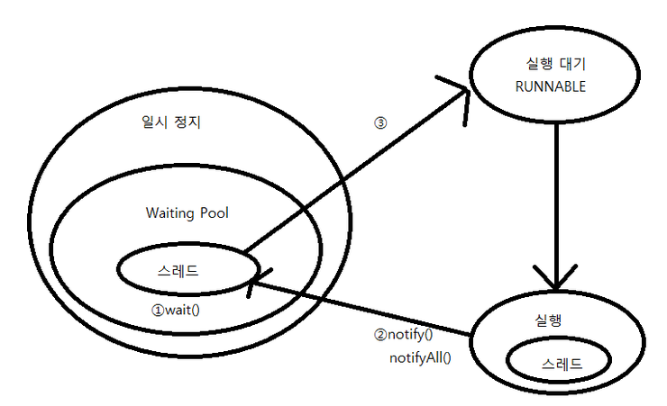
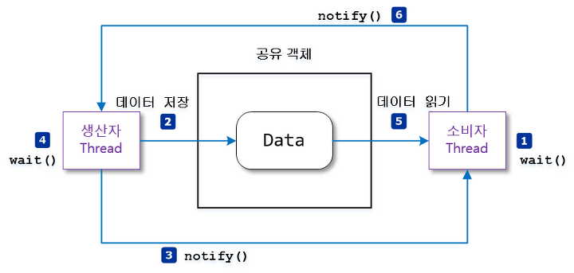

<h1>스레드 상태 제어</h1>
<strong>스레드 상태 제어:</strong> 실행 중인 스레드의 상태를 변경하는 것. 

*아래 그림에서 취소선을 가진 메소드들은 스레드의 안전성을 해친다고 판단되어 더 이상 사용되지 않도록 권고된(Deprecated) 메소드들이다.*

*위 표에서 wait(), notify(), notifyAll()은 모두 Object 클래스의 메소드들이다. 그 이외의 메소드들은 모두 Thread 클래스의 메소드들이다.*

<h2>주어진 시간동안 일시 정지(sleep())</h2>

~~~
try {
    Thread.sleep(1000);
} catch (InterruptedException e) {
    // interrupt() 호출되면 실행
}
~~~
- Thread 클래스의 static 메소드이다.
- Thread.sleep()호출한 스레드는 주어진 시간 동안 일시 정지 상태가 되고, 다시 실행 대기 상태로 돌아간다.
- millisecond 단위로 준다.
- 일시 정지된 상태에서 주어진 시간이 되기 전에 interrupt() 메소드가 호출되면 InterruptedException이 발생하기 때문에 예외 처리가 필요.

<h2>다른 스레드에게 실행 양보(yield())</h2>

~~~
public void run() {
    while(true) {
        if(work) {
            System.out.println("ThreadA 작업 내용");
        }
    }
}
~~~

만약 work의 값이 false라면 그리고 work의 값이 false에서 true로 변경되는 시점이 불명확하다면 while문은 <strong>무의미한 반복</strong>을 한다.
이것보다 다른 스레드에게 실행을 양보하고 자신은 실행 대기 상태로 가는 것이 전체 프로그램 성능 향상에 도움이 된다.
<strong>yield():</strong> 메소드를 호출한 스레드는 실행 대기 상태로 돌아가고, 동일한 우선순위 혹은 높은 우선순위를 갖는 다른 스레드가 실행될 수 있도록 한다.

~~~
public void run() {
    while(true) {
        if(work) {
            System.out.println("ThreadA 작업 내용");
        } else {
            Thread.yield();
        }
    }
}
~~~

<h4>예제</h4>

<strong>[YieldExample.java] 스레드 실행 양보 예제</strong>

~~~
public class YieldExample {
    public static void main(String[] args) {
        ThreadA threadA = new ThreadA();
        ThreadB threadB = new ThreadB();
        threadA.start();
        threadB.start(); // ThreadA, ThreadB 둘 다 실행

        try {
            Thread.sleep(3000);
        } catch (InterruptedException e) {}
        threadA.work = false; //ThreadB만 실행

        try {
            Thread.sleep(3000);
        } catch (InterruptedException e) {}
        threadA.work = true; // ThreadA, ThreadB 둘 다 실행

        try {
            Thread.sleep(3000);
        } catch (InterruptedException e) {}
        threadA.stop = false;
        threadB.stop = false; // 둘다 종료
    }
}
~~~

<strong>[ThreadA.java]</strong>

~~~
public class ThreadA extends Thread {
    public boolean stop = false;
    public boolean work = true;

    public void run() {
        while(!stop) {
            if (work) {
                System.out.println("ThreadA 작업 내용");
            } else {
                Thread.yield();
            }
        }
        System.out.println("ThreadA 종료");
    }
}
~~~

<strong>[ThreadB.java]</strong>

~~~
public class ThreadB extends Thread {
    public boolean stop = false;
    public boolean work = true;

    public void run() {
        while(!stop) {
            if (work) {
                System.out.println("ThreadB 작업 내용");
            } else {
                Thead.yield();
            }
        }
        System.out.println("ThreadB 종료");
    }
}
~~~

<h2>다른 스레드의 종료를 기다림(join())</h2>

스레드는 다른 스레드와 독립적으로 실행하는 것이 기본이지만 다른 스레드가 종료될 때까지 기다렸다가 실행해야하는 경우도 있다.

다음 예제는 메인 스레드는 SumThread가 계산 작업을 모두 마칠 때까지 일시 정지 상태에 있다가 SumThread가 최종 계산된 결과값을 산출하고 종료하면
결과값을 받아 출력한다.

<strong>[SumThread.java] 1부터 100까지 합을 계산하는 스레드</strong>

~~~
public class SumThread extends Thread {
    private long sum;

    public long getSum() {
        return sum;
    }

    public void setSum(long sum) {
        this.sum = sum;
    }

    public void run() {
        for(int i = 0; i <= 100; ++i) {
            sum += 1;
        }
    }
}
~~~

<strong>[JoinThread.java] 다른 스레드가 종료될 때까지 일시 정지 상태 유지</strong>

~~~
public class JoinExample {
    public static void main(String[] args) {
        SumThread sumThread = new SumThread();
        sumThread.start();

        //아래 세줄 주석 처리하면 1~100의 결과는 0이 출력된다.
        try {
            sumThread.join(); // sumThread가 종료될때까지 메인 스레드를 일시 정지 시킴.
        } catch (InterruptedException e) {}

        System.out.println("1~100 합 : " + sumThread.getSum());
    }
}
~~~

<h2>스레드간 협업(wait(), notify(), notifyAl())</h2>
경우에 따라서 두 개의 스레드를 교대로 번갈아가며 실행해야 할 경우가 있다. 정확한 교대 작업이 필요한 경우, 자신의 작업이 끝나면 상대방 스레드를 일시 정지 상태에서 풀어주고,
자신은 일시 정지 상태로 만든다. 이 방법의 핵심은 <strong>공유객체</strong>에 있다. 공유 객체는 두 스레드가 작업할 내용을 각각 동기화 메소드로 구분해 놓는다.

1. 한 스레드가 작업을 완료하면 notify() 메소드를 호출해서 일시 정지 상태에 있는 다른 스레드를 실행 대기 상태로 만든다.
2. 자신은 두 번 작업을 하지 않도록 wait() 메소드를 호출해서 일시 정지 상태로 만든다.

- notify() : wait()에 의해 일시 정지된 스레드 중 한 개를 실행 대기 상태로 만든다.
- notifyAll() : wait()에 의해 일시 정지된 모든 스레드들을 실행 대기 상태로 만든다.
 

해당 메소드들은 Thread클래스가 아닌 Object 클래스에 선언된 메소드이므로 모든 공유 객체에서 호출이 가능하다.
*단, 이 메소드들은 동기화 메소드 혹은 동기화 블록 내에서만 사용할 수 있다.*

<strong>[WorkObject.java] 두 스레드의 작업 내용을 동기화 메소드로 작성한 공유 객체</strong>

~~~
public class WorkObject {
    public synchronized void methodA() {
        System.out.println("ThreadA의 methodA() 작업 실행");
        notify(); // 일시 정지 상태에 있는 ThreadB를 실행 대기 상태로 만듬.
        try {
            wait(); // ThreadA를 일시 정지 상태로 만듬.
        } catch (InterruptedException e) {}
    }

    public synchronized void methodB() {
        System.out.prinln("ThreadB methodB() 작업 실행");
        notify();
        try {
            wait();
        } catch (InterruptedException e) {}
    }
}
~~~

<strong>[ThreadA.java] WorkObject의 methodA() 를 실행하는 스레드</strong>

~~~
public class ThreadA extends Thread {
    private WorkObject workObject;

    public ThreadA(WorkObject workObject) {
        this.workObject = workObject;
    }

    @Override
    public void run() {
        for (int i = 0; i < 10; ++i) {
            workObject.methodA();
        }
    }
}
~~~

<strong>[ThreadB.java] WorkObject의 methodB()를 실행하는 스레드</strong>

~~~
public class ThreadB extends Thread {
    private WorkObject workObject;

    public ThreadB(WorkObject workObject) {
        this.workObject = workObject;
    }

    @Override
    public void run() {
        for (int i = 0; i < 10; ++i) {
            workObject.methodB();
        }
    }
}
~~~

<strong>[WaitNotifyExample.java] 두 스레드를 생성하고 실행하는 메인 스레드</strong>

~~~
public class WaitNotifyExample {
    public static void main(String[] args) {
        WorkObject sharedObject = new WorkObject();

        ThreadA threadA = new ThreadA(sharedObject);
        ThreadB threadB = new ThreadB(sharedObject);

        threadA.start();
        threadB.start();
    }
}
~~~

<h4>예제</h4>
데이터를 저장하는 스레드(생산자 스레드)가 데이터를 저장하면, 데이터를 소비하는 스레드(소비자 스레드)가 데이터를 읽고 처리하는 교대 작업을 구현한 것.

- producer thread : 소비자 스레드가 읽기 전에 새로운 데이터를 두 번 생성하면 안됨.(setData()를 두 번 실행하면 안됨.)
- consumer thread : 생산자 스레드가 새로운 데이터를 생성하기 전에 이전 데이터를 두 번 읽어서도 안된다.(getData() 메소드를 두 번 실행하면 안됨.)
 
<strong>구현 방법: </strong> 

공유 객체에 데이터를 저장할 수 있는 data 필드의 값 기준

- null이면 생산자 스레드를 실행 대기 상태로 만들고, 소비자 스레드를 일시 정지 상태로 만든다.
- null이 아니면 소비자 스레드를 실행 대기 상태로 만들고, 생산자 스레드를 일시 정지 상태로 만든다.

<strong>[DataBox.java] 두 스레드의 작업 내용을 동기화 메소드로 작성한 공유 객체</strong>

~~~
public class DataBox {
    private String data;

    public synchronized String getData() {
        if (this.data == null) {
            try {
                wait(); // data 필드가 null이면 소비자 스레드를 일시 정지 상태로 만듬.
            } catch (InterruptedException e) {}
        }
        String returnValue = data;
        System.out.println("ConsumerThread가 읽은 데이터 : " + returnValue);
        data = null;
        notify(); // data 필드를 null로 만들고 생산자 스레드를 실행 대기 상태로 만듬.
        return returnValue;
    }

    public synchhronized void setData(String data) {
        if (this.data != null) {
            try {
                wait();
            } catch (InterruptedException e) {}
            this.data = data;
            System.out.println("ProducerThread가 생성한 데이터 : " + data);
            notify();
        }
    }
}
~~~

<strong>[ProducerThread.java] 데이터를 생산(저장)하는 스레드</strong>

~~~
public class ProducerThread extends Thread {
    private DataBox dataBox;

    public ProducerThread(DataBox dataBox) {
        this.dataBox = dataBox;
    }

    @Override
    public void run() {
        for (int i = 0; i <= 3; ++i) {
            String data = "Data-" + i;
            dataBox.setData(data);
        }
    }
}
~~~

<strong>[ConsumerThread.java] 데이터를 소비하는(읽는) 스레드</strong>

~~~
public class ConsumerThread extends Thread {
    private DataBox dataBox;

    public ConsumerThread(DataBox dataBox) {
        this.dataBox = dataBox;
    }

    @Override
    public void run() {
        for(int i = 0; i <= 3; ++i) {
            String data = dataBox.getData();
        }
    }
}
~~~

<strong>[WaitNotifyExample.java] 두 스레드를 생성하고 실행하는 메인 스레드</strong>

~~~
public class WaitNotifyExample {
    public static void main(String[] args) {
        DataBox dataBox = new DataBox();

        ProducerThread producerThread = new ProducerThread(dataBox);
        ConsumerThread consumerThread = new ConsumerThread(dataBox);

        producerThread.start();
        consumerThread.start();
    }
}
~~~

<h2>스레드의 안전한 종료(stop 플래그, interrupt())</h2>

스레드는 자신의 run() 메소드가 모두 실행되면 자동적으로 종료된다. 하지만 경우에 따라서 실행 중인 스레드를 즉시 종료할 필요가 있다.
예를 들어 동영상을 끝까지 보지 않고 사용자가 끌 수 있다. Thread를 종료시키기 위해 stop()메소드를 제공하는데 이 메소드는 Deprecated되었다. 

*stop() 메소드로 갑자기 종료하면, 스레드가 사용중이던 자원들(파일, 네트워크 연결 등)이 불안전한 상태로 남겨지기 때문이다.*

<h4>stop 플래그를 이용하는 방법</h4>

스레드는 run() 메소드가 끝나면 자동적으로 종료되므로, stop 플래그를 이용해서 run() 메소드가 정상적으로 종료되도록 유도하는 것이 최선이다.

~~~
public class XXXThread extends Thread {
    private boolean stop; // stop 플래그 필드

    public void run() {
        while(!stop) { //stop이 true가 되면 run()이 종료된다.
            //스레드가 반복 실행하는 코드;
        }
        //스레드가 사용한 자원 정리
    }
}
~~~

<strong>[StopFlagExample.java] 1초 후 출력 스레드를 중지시킴</strong>

~~~
public class StopFlagExample {
    public static void main(String[] args) {
        PrintThread1 printThread = new PrintThread1();
        printThread.start();

        try {
            Thread.sleep(1000);
        } catch (InterruptedException e) {}

        printThread.setStop(true); //스레드를 종료시키기 위해 stop 필드를 true로 변경
    }
}
~~~

<strong>[PrintThread1.java] 무한 반복해서 출력하는 스레드</strong>

~~~
public class PrintThread1 extends Thread {
    private boolean stop;

    public void setStop(boolean stop) {
        this.stop = stop;
    }

    public void run() {
        while(!stop) {
            System.out.println("실행 중");
        }

        System.out.println("자원 정리");
        System.out.println("실행 종료");
    }
}
~~~

<h4>interrupt() 메소드를 이용하는 방법</h4>
<strong>interrupt() : </strong>스레드가 일시 정지 상태에 있을 때(Thread.sleep()) InterruptedException 예외를 발생시키는 역할을 한다.
이것을 이용해서 run()메소드를 정상 종료시킬 수 있다.

<strong>[InterruptedExample.java] 1초 후 출력 스레드를 중지시킴</strong>

~~~
public class InterruptExample {
    public static void main(String[] args) {
        Thread thread = new PrintThread2();
        thread.start();

        try {
            Thread.sleep(1000);
        } catch (InterruptedException e) {}

        thread.interrupt(); // 스레드를 종료시키기 위해 InterruptedException 을 발생시킴.
    }
}
~~~

<strong>[PrintThread2.java] 무한 반복해서 출력하는 스레드</strong>

~~~
public class PrintThread2 extends Thread {
    public void run() {
        try {
            while(true) {
                System.out.println("실행 중");
                Thread.sleep(1);
            }
        } catch (InterruptedException e) {}

        System.out.println("자원 정리");
        System.out.println("실행 종료");
    }
}
~~~

<strong>스레드가 실행 대기 / 실행 상태에 있을 때 interrupt() 메소드가 실행되면 즉시 InterruptedException이 발생하지 않고, 스레드가 미래에 일시 정지 상태가 되면
InterruptedException 예외가 발생한다. 따라서 스레드가 일시 정지 상태가 되지 않으면 interrupt 메소드 호출은 아무 의미가 없다.</strong>
 

일시 정지를 만들지 않고도 interrupt() 호출 여부를 알 수 있는 방법이 있다.
~~~
boolean status = Thread.interrupted();      // static 메소드
boolean status = objThread.isInterrupted(); // instance 메소드
~~~

<strong>[PrintThread2.java] 무한 반복해서 출력하는 스레드2</strong>

~~~
public class PrintThread2 extends Thread {
    public void run() {
        while(true) {
            System.out.println("실행 중");
            if(Thread.interrupted()) {
                break;
            }
        }

        System.out.println("자원 정리");
        System.out.println("실행 종료");
    }
}
~~~