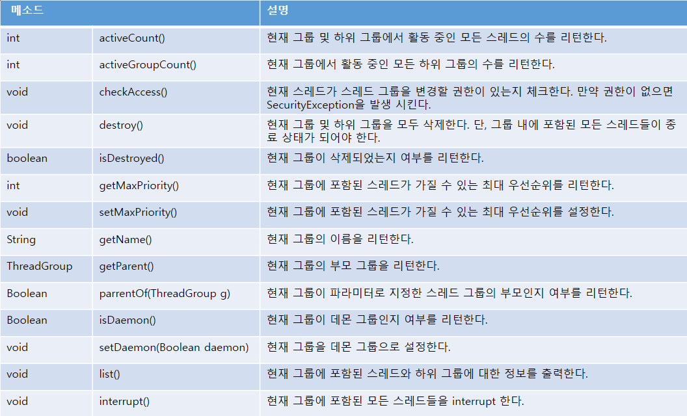

<h1>Thread Group</h1>

<strong>Thread Group : </strong>관련된 스레드를 묶어서 관리할 목적으로 이용된다.

1. JVM이 실행되면 system 스레드 그룹을 만든다
2. system 의 하위 스레드 그룹으로 main을 만들고, 메인 스레드를 main 스레드를 main 스레드 그룹에 포함시킨다.
   
*스레드는 반드시 하나의 스레드 그룹에 포함되는데, 명시적으로 스레드 그룹에 포함시키지 않으면 기본적으로 자신을 생성한 스레드와 같은 스레드 그룹에 속한다.*
 
 
*우리가 생성하는 작업 스레드는 대부분 main 스레드가 생성하므로 기본적으로 main 스레드 그룹에 속하게 된다.*
 

<h2>스레드 그룹 이름 얻기 </h2>

~~~
ThreadGroup threadGroup = Thread.currentThread().getThreadGroup();
String groupName = threadGroup.getName();
~~~

Thread의 정적 메소드인 getAllStackTraces()를 이용하면 프로세스 내에서 실행하는 모든 스레드에 대한 정보를 얻을 수 있다.

~~~
Map<Thread, StackTraceElement[]> map = Thread.getAllStackTraces();
//StackTraceElement[] : 스레드의 상태 기록을 갖고 있음.
~~~

<strong>[ThreadInfoExample.java] 현재 실행중인 스레드 정보</strong>

~~~
public class ThreadInfoExample {
    public static void main(String[] args) {
        AutoSaveThread autoSaveThread = new AutoSaveThread();
        autoSaveThread.setName("AutoSaveThread");
        autoSaveThread.setDaemon(true);
        autoSaveThread.start();

        Map<Thread, StackTraceElement[]> map = Thread.getAllStackTraces();
        for(Thread thread : map.keySet()) {
            System.out.println("Name : " + thread.getName() + ((thread.isDaemon()) ? "(Daemon)" : "(main)"));
            System.out.println("");
        }
    }
}
~~~

<h2>스레드 그룹 생성</h2>

명시적으로 스레드 그룹을 만들고 싶다면, 다음 생성자 중 하나를 이용한다.
~~~
ThreadGroup tg = new ThreadGroup(String name);
ThreadGroup tg = new ThreadGroup(ThreadGroup parent, String name); // parent thread group과 name을 같이 넘긴다.
~~~
 
 
스레드 그룹 생성 시 부모 스레드 그룹을 지정하지 않으면, 기본적으로 현재 스레드가 속한 그룹의 하위 그룹으로 생성된다. 
예를 들어 main 스레드가 ThreadGroup(String name)을 이용해서 새로운 스레드 그룹을 생성하면 main 스레드 그룹의 하위 스레드 그룹이 된다.

 
 
*새로운 스레드 그룹을 생성한 후, 이 그룹에 스레드를 포함시키려면 Thread 객체를 생성할 때 생성자 매개값으로 스레드 그룹을 지정하면 된다.*

~~~
Thread t = new Thread(ThreadGroup group, String name);
Thread t = new Thread(ThreadGroup group, Runnable target);
Thread t = new Thread(ThreadGroup group, Runnable target, String name);
Thread t = new Thread(ThreadGroup group, Runnable target, String name, long stackSize);
~~~

<h2>스레드 그룹의 일괄 interrupt()</h2>

스레드 그룹에서 제공하는 interrupt() 메소드를 이용하면 그룹 내에 포함된 모든 스레드를 일관 interrupt() 할 수 있다. 
예를 들어 10개의 스레드를 모두 종료시키기 위해 각 스레드에서 interrupt() 메소드를 10번 호출할 수 있지만, 이 스레드들이 같이 스레드 그룹에 소속되있는 경우,
스레드 그룹의 interrupt() 메소드를 한번만 호출 해주면 된다.
 
*스레드 그룹의 interrupt() 메소드는 포함된 모든 스레드의 interrupt() 메소드를 내부적으로 호출해준다. 단 호출만 해줄뿐 개별 스레드에서 발생하는
InterruptedException 에 대한 예외처리는 하지않으므로, 안전한 종료를 위해서 개별 스레드가 예외처리를 해야한다.*

 
 

<h5>스레드 그룹 생성 / 정보 출력, 3초 후 스레드 그룹의 interrupt() 메소드를 호출</h5>

<strong>[WorkThread.java] InterruptedException이 발생할 때 스레드가 종료되도록 함.</strong>

~~~
public class WorkThread extends Thread {
    public WorkThread(ThreadGroup threadGroup, String threadName) {
        super(threadGroup, threadName);
    }

    @Override
    public void run() {
        while(true) {
            try {
                Thread.sleep(1000);
            } catch (InterruptedException e) {
                System.out.println(getName() + " interrupted");
                break;
            }
        }
        System.out.println(getName() + " 종료됨.");
    }
}
~~~

<strong>[ThreadGroupExample.java] 스레드 그룹을 이용한 일괄 종료 예제</strong>

~~~
public class ThreadGroupExample {
    public static void main(String[] args) {
        ThreadGroup myGroup = new ThreadGroup("myGroup");
        WorkThread workThreadA = new WorkThread(myGroup, "workThreadA");
        WorkThread workThreadB = new WorkThread(myGroup, "workThreadB");

        workThreadA.start();
        workThreadB.start();

        System.out.println("[ main 스레드 그룹의 list() 메소드 출력 내용]");
        ThreadGroup mainGroup = Thread.currentThread().getThreadGroup();
        mainGroup.list();
        System.out.println("");

        try {
            Thread.sleep(3000);
        } catch (InterruptedException e) {}

        System.out.println("[ myGroup 스레드 그룹의 interrupt() 메소드 호출]");
        myGroup.interrupt();
    }
}
~~~

