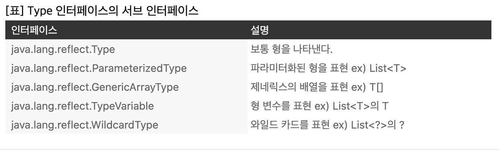

<h1>Type token</h1>
<strong>about Type Erasure:</strong> https://medium.com/asuraiv/java-type-erasure%EC%9D%98-%ED%95%A8%EC%A0%95-ba9205e120a3

- 클래스 리터럴: String.class, Integer.class 등이며, String.class의 타입은 Class<String>, Integer.class의 타입은 Class<Integer>이다.
- 타입 토큰: 타입을 나타내는 토큰이며, <strong>클래스 리터럴이 타입 토큰으로서 사용된다.</strong>
- myMethod(Class<?>clazz)는 타입 토큰을 인자로 받는 메소드이며, myMethod(String.class)로 호출하면, String.class라는 클래스를 타입 토큰 파라미터로 myMethod에 전달한다.

<strong>타입 토큰 사용 사례</strong> 
범용적으로 말하자면 <strong>타입 토큰은 타입 안전성이 필요한 곳에 사용된다.</strong> 

~~~
MyLittleTelevision mlt = objectMapper.readValue(jsonString, MyLittelTelevision.class);
~~~

~~~

public class TypeToken {
    //자바의 type eraser에 의해 컴파일되면 사라진다.모두 Object 타입으로 된다.
    //컴파일러가 체크를 하고 캐스팅하는 코드를 모두 넣어준다.

    static <T> T create(Class<T> clazz) throws Exception {
        return clazz.newInstance();
    }

    public static void main(String[] args) throws Exception {
        String o = create(String.class);
        System.out.println(o.getClass());
    }
}

~~~

아래 처럼 만들면 사용하는 쪽에서 캐스팅을 해야한다.

~~~
Map<String, Object> map = new HashMap<>();
~~~

아래의 문제점은 주석 친 부분처럼 사용할 수 있다.

~~~
class TypeSafeMap {
    Map<Class<?>, Object> map = new HashMap<>();

    void put(Class<?> clazz, Object value) {
        map.put(clazz, value);
    }
}

public static void main(String[] args) throws Exception {
    TypeSafeMap m = new TypeSafeMap();
    //m.put(Integer.class, "value");
    m.put(String.class, "value");
}
~~~

따라서 TypeSafeMap 의 파라미터를 맞춰주는게 좋다. 컴파일러가 체크할 수 있도록 하는게 핵심

~~~
class TypeSafeMap {
    Map<Class<?>, Object> map = new HashMap<>();

    <T> void put(Class<T> clazz, T value) {
        map.put(clazz, value);
    }

    <T> T get(Clazz<T> clazz) {
        //cast 메소드 : Object객체를 upcasting 해준다.
        return clazz.cast(map.get(clazz));

        //return (T)clazz.cast(map.get(clazz)); 이렇게 하면 타입 세이프한게 아니다
    }
}
~~~

<strong>Type Token: </strong> 타입에 대한 정보를 값으로 넘기겠다는 의미. 

<strong>Type Token의 한계</strong> 
아래의 경우에서 List<Integer>가 있던 상태에서 List<String>을 넣으면 덮어씌워진다.

~~~
m.put(List.class, List.of(1, 2, 3));
m.put(List.class, List.of("a", "b", "c"));
~~~

그래서 아래와 같이 변경하면 오류가 발생한다. 
클래스 리터럴로 오브젝트를 가져올 때, 해당 클래스에 대한 오브젝트를 가져올 때 타입 정보를 가지고 가져올 수 없기 때문이다. 
왜냐하면 해당 클래스에는 제네릭 타입에 대한 정보가 없기 때문이다.

~~~
m.put(List<Integer>.class, List.of(1, 2, 3));
~~~

<strong>따라서 이런 방식으로는 제네릭 타입이 있는 타입 토큰을 사용할 수 없다.</strong> 

<strong>언어에서 Generic을 지원하는 두 가지 방법</strong>

- ERASURE(java): 컴파일 시점에 제네릭에 대한 정보를 다 지워버림
- REFICATION: FEFIABLE하게 만드는 것(c#) -> 구체화 하는 것. 실제로 바이트 코드에 제네릭에 대한 정보를 남긴다.

<h1>Super Type Token</h1>

<h3>우리가 원하는 것</h3>
<strong>List<String>.class 와 List<Integer>.class를 구분하고 싶다</strong> 

아래에서 출력의 결과는 String이 아닌 Object다. 컴파일 시점에 타입에 대한 정보가 다 지워지므로
리플랙션을 이용해도 Sup.value의 타입을 알 수 없다.

~~~
public class SuperTypeToken {
    static class Sup<T> {
        T value;
    }

    public static void main(String[] args) throws NoSuchFieldException {
        Sup<String> s = new Sup<>();

        System.out.println(s.getClass().getDeclaredField("value").getType());
    }
}
~~~

특정 경우에는 해당 정보를 가져올 수 있다.
아래와 같은 경우에는 String 타입을 얻을 수 있다. 즉 런타임에도 알 수 있는 특정한 상황이 존재한다.

~~~
public class SuperTypeToken {
    static class Sup<T> {
        T value;
    }

    //여기서 Sup<String>은 리플렉션을 통해 런타임시에 접근할 수 있도록 런타임 시에 해당 정보가 남아있다.
    static class Sub extends Sup<String> {

    }

    public static void main(String[] args) throws NoSuchFieldException {
        //아래의 경우는 바이트 코드 호환성 문제 때문에 '<String>'이라는 정보를 다 삭제한다.
        Sup a = new Sup<String>();

        Sub b = new Sub();
        Type t = b.getClass().getGenericSuperclass(); //여기서 반환값은 Sup<String>
        ParameterizedType ptype = (ParameterizedType)t;
        System.out.println(ptype.getActualTypeArguments()[0]); 
    }
}
~~~

<strong>getGenericSuperclass()</strong>

- 바로 위의 수퍼 클래스의 타입을 반환한다.
- 바로 위의 수퍼 클래스가 ParameterizedType이면, <strong>실제 타입 파라미터들을 반영한 타입을 반환한다.</strong>
- 위의 예시에서 Sup가 String이라는 파라미터를 사용하고 있는 ParameterizedType이면, sub.getClass().getGenericSuperclass()는 String 정보가 포함되 있는 타입을 반환한다.

이러한 메서드를 통해 java.lang.reflect.Type 인터페이스를 구할 수 있지만, 
형 변수 및 와일드 카드 등의 정보는 반환값이 다음표의 해당하는 서브 인터페이스로 결정된다.

다음과 같이 local class로 만들어도 사용가능하다.
이 경우는 <strong>Sub가 Sup을 확장하면서 타입인자를 지정해준 것이라서 타입 소거가 안된다.</strong>
~~~
public class SuperTypeToken {
    static class Sup<T> {
        T value;
    }

    public static void main(String[] args) throws NoSuchFieldException {
        //LOCAL CALSS
        class Sub extends Sup<String> {}

        //ANONYMOUS CLASS: 순수한 익명 클래스 -> 이 코드 자체가 내부적으로 임의의 클래스를 만들고,
        //그 클래스의 인스턴스를 반환해준다.

        Sup b = new Sup<String>() {};
    }
}
~~~

이걸 TypeSafeMap에 적용해보자.

~~~
public class SuperTypeToken {
    static class TypeSafeMap {
        Map<TypeReference<?>, Object> map = new HashMap<>();

        <T> void put(TypeReference<T> tr, T value) {
            map.put(tr, value);
        }

        <T> T get(TypeReference<T> tr) {
            if (tr.type instanceof Class<?>) {
                return ((Class<T>)tr.type).cast(map.get(tr));
            } else {
                return ((Class<T>)((ParameterizedType)tr.type).getRawType()).cast(map.get(tr));
            }
        }
    }

    static class TypeReference<T> {
        Type type;

        //동작할 때 Generic type을 읽어오도록 만든다.
        public TypeReference() {
            Type stype = getClass().getGenericSuperclass();
            if (stype instanceof Paramterized) {
                this.type = ((ParameterizedType)stype).getActualTypeArguments()[0];
            } else {
                throw new RuntimeException();
            }
        }

        //equals랑 hashCode 오버라이드 되있다고 가정
    }

    public static void main(String[] args) throws Exception {
        //아래는 RuntimeException -> 자기 자신은 Type 정보 안남으므로
        //TypeReference t = new TypeReference<String>();

        TypeReference t = new TypeReference<String>() {};
        System.out.println(t.type);

        TypeSafeMap m = new TypeSafeMap();
        m.put(new TypeReference<Integer>(){}, 1);
        m.put(new TypeReference<String>(){}, "String");
        m.put(new TypeReference<List<String>>(){}, List.of("a","b","c"));
        m.put(new TypeReference<List<Integer>>(){}, List.of(1, 2, 3));

        System.out.println(m.get(new TypeReference<Integer>(){}));
        System.out.println(m.get(new TypeReference<String>(){}));
        System.out.println(m.get(new TypeReference<List<String>>(){}));
        System.out.println(m.get(new TypeReference<List<Integer>>(){}));
    }
}
~~~

<strong>스프링에서 지원하는 객체</strong>

~~~
public class SpringTypeParameter {
    public static void main(String[] args) {
        ParemeterizedTypeReference<?> typeRef = new ParemeterizedTypeReference<List<Map<Set<Integer>, String>>>() {};
        System.out.println(typeRef.getType());
    }
}
~~~

<h3>이런건 언제 쓸까...?</h3>

~~~
@RestController
public static class MyController {
    public List<User>;

    @RequestMapping("/")
    public List<User> users() {
        return List.of(new User("A"), new User("B"), new User("C"));
    }
}

@AllArgsContructor
@Data
public static class User {
    String name;
}
~~~

이걸 아래와 같이 받으면 ClassCastException 발생

~~~
public class SpringTypeReference {
    public static void main(String[] args) {
        RestTemplate rt = new RestTemplate();
        List<User> users = rt.getForObject("http://localhost:8080", List.class);
        System.out.println(users.get(0).getName());
    }
}
~~~

- 일단 컴파일되면 'List users = ~~'로 바뀐다.
- 또 getForObject에서 두번째 파라미터로 List라고만 줬다. 따라서 스프링의 RestTemplate이 'List<user>.class'임을 알 수가 없다.
- 저쪽에서 보낸게 [{name: 'A'},{name: 'B'},{name: 'C'}] 이런식으로 온다. 따라서 컴파일 시점에 제네릭 정보 사라진 List로 받을 수 없다.
- 따라서 오른쪽의 반환을 LinkedHashMap으로 변환하는데, 여기서 List로 받으려고 했으므로 에러가 발생한다.
- 왼쪽은 List<Map>으로 변경하면 동작하긴 한다.

<strong>여기서 사용할 수 있다.</strong>

~~~
public class SpringTypeReference {
    public static void main(String[] args) {
        RestTemplate rt = new RestTemplate();

        List<User> users = rt.exchange("http://localhost:8080"
                    ,HttpMethod.GET
                    , null
                    , new ParameterizedTypeReference<List<User>>(){}
                ).getBody();
        
        users.forEach(System.out::println);
    }
}
~~~