<h1>실행</h1>
자바 애플리케이션은 java 명령어로 실행할 수 있다.

~~~
java 명령어는 자바 애플리케이션을 실행한다.
java 명령어는 먼저 JRE(Java Runtime Environment)를 시작하고, 인자로 지정된 클래스(public static void main(String[]args)를 포함하고 있는 클래스)를 로딩하고, main()메소드를 실행한다.
~~~

<h2>JRE 시작</h2>

java 명령 실행에 의해 JRE가 시작된다는 것은 java 명령어의 인자로 지정된 클래스를 실행하기 위한 자바 실행 환경이 조성됨을 의미한다. java 명령어의 인자로 지정한 설정 옵션에 맞게 JVM이 실행되고 JVM이 클래스 로더를 이용해서 initial class를 create하고, initial class를 link하고 initialize하고, main 메소드를 실행한다.

- initial class: JVM 구현에 따라 다를 수 있지만, 일반적으로 main 메소드를 포함하는 클래스로서 java 명령어의 인자로 지정되는 클래스(BootStrap Class Loader가 로딩해준다.)
- create: 해당 클래스나 인터페이스의 바이트 코드를 로딩해서 JVM이 할당한 메모리(Method Area)에 Contruction하는 것.
- link(a class or interface): 해당 클래스나 인터페이스의 바로 위 수퍼클래스나 수퍼인터페이스, 또는 배열일 경우 배열의 원소인 클래스나 인터페이스를 확인(verify)/ 준비(prepare)하고, 심볼릭 참조를 해석(resolve)해서 JVM에서 실행할 수 있는 상태로 만드는 것.
- initialize(a class or interface): 해당 클래스나 인터페이스의 initialization method를 실행하는 것.
- load: 해당 클래스나 인터페이스의 바이너리 표현을 찾아서 그 바이너리 표현으로부터 클래스나 인퍼헤이스를 생성하는 것(create)

<h2>Runtime Data Area</h2>

여기서 '단위'라는 구분 단계를 추가한 이유는 스펙에도 per-class, per-thread라는 표현이 나오기 떄문인데, 여기에서 '단위'는 생명 주기와 생성 단위를 의미한다.
<strong>JVM단위에 속하는 힙과 메소드 영역은 JVM이 시작될 때 생성되고, JVM이 종료될 때 소멸되며, JVM하나에 힙 하나 메소드 영역도 하나가 생성된다.</strong>
마찬가지로 <strong>클래스 단위에 속하는 런타임 상수풀은 클래스가 생성/ 소멸될 때 함께 생성/소멸되며, 클래스 하나에 런타임 상수풀도 하나가 생성된다.</strong> 스레드 단위에 속하는 PC 레지스터, JVM 스택, 네이티브 메소드 스택도 스레드가 생성/소멸될 때 함께 생성/소멸되며, <strong>스레드 하나에 PC레지스터, JVM 스택, 네이티브 메소드 스택도 하나씩 생성된다.</strong>

<h2>실제 동작 과정</h2>

//힙에서 객체가 생성되는 것을 확인하기 위해 Hello 인스턴스를 만들고 무한루프로 프로그램의 종료를 일부러 막아둔 코드

~~~
public class Hello {
    public static void main(String[] args) {
        final Hello hello = new Hello();
        System.out.println(hello.helloMessage());
        while(true) {}
    }
}
~~~

<h3>JVM 실행</h3>

**java 명령어가 실행되면 JRE가 조성되면서 JVM이 실행된다. JVM이 실행되면 JVM 단위로 생성되는 힙과 메소드 영역이 함께 생성된다.**

<h4>Heap</h4>

<strong>힙은 인스턴스화 된 모든 클래스 인스턴스와 배열을 저장하는 공간이며, 모든 JVM 스레드에 공유된다.</strong> 힙에 저장된 객체에 할당된 메모리는 명시적인 방법으로는 절대 회수하지 못하며, 오직 Garbage collector에 의해서만 회수될 수 있다. Hello는 이 시점에서는 아직 인스턴스화 되지 않았으므로 Heap은 비어있다.

<h4>Method Area</h4>

메소드 영역은 런타임 상수 풀, 필드와 메소드 데이터, 생성자 및 메소드의 코드 내용을 저장한다. 바이트 코드에는 런타임 상수 풀이 아니라 그냥 상수 풀이 포함된다. <strong>런타임 상수 풀은 이 상수 풀을 바탕으로 런타임에, 더 구체적으로는 메소드 영역에 저장될 때 만들어진다.</strong> Hello는 이 시점에 아직 생성되지 않았으므로 메소드 영역도 비어있다.

**JVM 스펙은 런타임 데이터 영역을 6가지로 나눠서 설명하고 있고, 그에 따라 그림에서도 힙과 메소드 영역을 분리해서 표현했지만, 스펙에는 메소드 영역이 논리적으로 힙의 일부지만(따라서 가비지 컬렉션의 대상이 되지만), 메소드 영역의 위치에 대해 강제하지 않는다고 나와있으며, 메소드 영역의 위치는 JVM 구현체에 따라 달라질 수 있다.**

<h3>시작 클래스 생성</h3>

시작 클래스는 Hello를 지칭하며, 시작 클래스를 생성하는 것은 파일 시스템에 있는 Hello.class 파일을 JVM의 메소드 영역으로 읽어들이는 것을 의미한다. 따라서 이 시점에서 Hello의 바이트 코드 내용이 메소드 영역에 저장된다.

<h4>런타임 상수 풀</h4>

클래스가 생성되면 런타임 상수 풀도 함께 생성된다고 했다. <strong>런타임 상수 풀에는 컴파일 탕미에 이미 알 수 있는 리터럴 값부터 런타임에 해석되는 메소드와 필드의 참조까지를 포괄하는 여러 종류의 상수가 포함된다.</strong> 런타임 상수 풀은 다른 전통적인 언어에서 말하는 심볼 테이블과 비슷한 기능을 한다고 보면된다.

<h3>링크</h3>

링크는 클래스나 인터페이스의 바로 위 수퍼클래스나 수퍼인터페이스, 또는 배열일 경우 배열의 원소인 클래스나 인터페이스를 확인(verify)/준비(prepare)하고, 심볼릭 참조를 해석(resolve)하는 과정을 말한다.

<h4>확인(Verify)</h4>

확인(Verification)은 클래스나 인터페이스의 바이너리 표현이 구조적으로 올바른지를 보장해주는 과정이다. 확인 과정은 다른 클래스나 인터페이스의 로딩을 유발할 수도 있지만, 로딩된 다른 클래스나 인터페이스의 확인이나 준비를 필수적으로 유발하지는 않는다. Hello.class 파일은 JDK에 포함된 공식 컴파일러인 javac에 의해 정상적으로 컴파일 됐으므로 구조적으로 올바르다고 갖어하면, 확인 과정에서 Hello의 부모 클래스인 Object 클래스가 로딩된다.

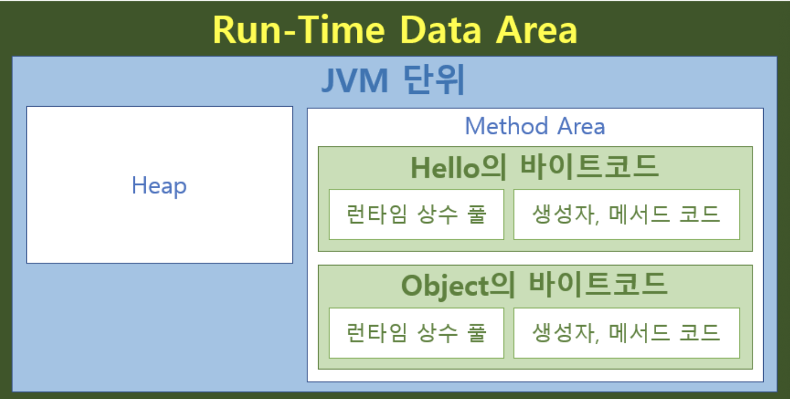

<h4>준비(Preperation)</h4>

준비(Preperation)는 클래스나 인터페이스의 정적(static) 필드를 생성하고 기본값으로 초기화하는 과정이다. 준비 과정에서 JVM 코드의 실행을 필요로 하지 않으며 <strong>기본 값이 아닌 특정 값으로 정적 필드를 초기화하는 과정은 준비 과정이 아니라 초기화 과정에서 수행된다.</strong> 스펙에 정의된 기본형 타입의 기본값과 참조형 타입의 기본값은 다음과 같다.

Hello에는 static field가 없으므로 이 과정에서 특별히 수행되는 것은 없다.

<h4>해석(Resolution)</h4>
<strong>런타임 상수 풀에 있는 심볼릭 참조가 구체적인 값을 가리키도록 동적으로 결정하는 과정</strong>이다. 초기 상태의 런타임 상수풀에 있는 심볼릭 참조는 해석되어져 있지 않다.

<h3>링크의 조건</h3>

JVM 스펙에서는 링크가 언제 수행되어야 하는지 규정하지 않고 유연하게 구현될 수 있는 여지를 주고 있다.

- 클래스나 인터페이스는 링크되기 전에 먼저 완전히 로딩되어야 한다.
- 클래스나 인스턴스는 초기화되기 전에 먼저 완전히 확인되고 준비되어야 한다.
- 링크 관련 에러는 해당 클래스나 인터페이스에 대한 링크를 필요로 하는 행위가 수행되는 시점에 throw되어야 한다.
- 동적으로 계산되는(dynamically-computed) 상수 A에 대한 심볼릭 참조는, A를 참조하는 명령어가 실행되거나, A를 정적 인자로 참조하는 부트스트랩 메소드가 호출되기 전까지는 해석되지 않는다.
- 동적으로 계산되는(dynamically-computed) call site B에 대한 심볼릭 참조는, B를 정적 인자로 참조하는 부트스트랩 메서드가 호출되기 전까지는 해석되지 않는다.

 
 
<strong>해석 시점은 JVM 구현체에 따라 다를 수 있다. 지연(lazy) 링크 전략을 사용하면 클래스나 인터페이스에 포함된 심볼릭 참조는 해당 참조가 실제 사용될 때 개별적으로 해석된다. 반면에 즉시(eager) 링크 전략을 사용하면 클래스나 인터페이스가 확인될 때 모든 심볼릭 참조가 한꺼번에 해석된다. 지연 링크를 사용하면 해석 과정은 클래스나 인터페이스가 초기화 된 후에 실행될 수도 있다.</strong>

1. Object 클래스가 확인(Verify) 과정에서 메소드 영역에 로딩되어 있으므로, 메소드 영역에 저장된 Object 클래스의 바이트코드 내용에서 생성자(<init>)의 위치를 알아낼 수 있고 그 위치를 Methodref jvva/lang/Object."<init>"의 값으로 해석할 수 있다.

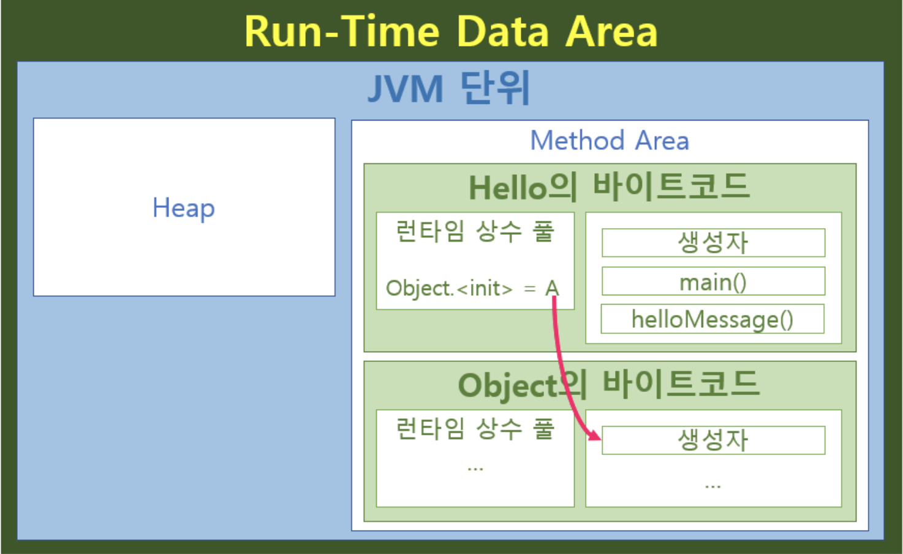

2. Hello 인스턴스를 만들 때 필요한 Hello 클래스 정보는 이미 메소드 영역에 로딩되어 있으므로, 메소드 영역 내에서 Hello 클래스의 위치를 Class home/efficio/jvm/sample/Hello의 값으로 해석할 수 있다.

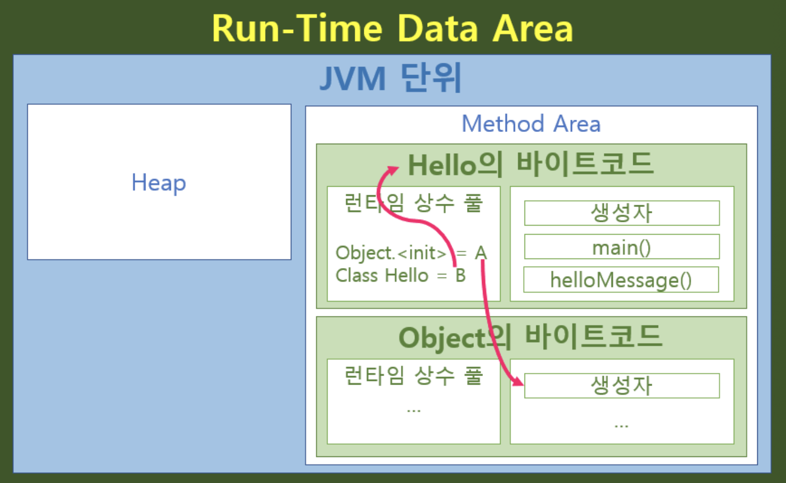

3. Hello의 생성자를 가리키는 Methodref 항목도 초기화해줄 수 있다.

4. System 클래스는 아직 로딩되어 있지 않으므로 먼저 로딩하고, 확인 후 준비 과정을 거치면서 System 클래스의 정적 필드인 out의 타입인 PrintStream 클래스도 로딩되고 참조형 변수인 out은 기본값인 null로 초기화된다.

<strong>대략 이런식으로 로딩-링크 과정이 연쇄적으로 수행되면서 메소드 영역이 채워지고, 메소드 영역 내에서 클래스 단위로 생성되는 런타임 상수 풀 안에 있는 심볼릭 참조가 가리키는 값들이 결정된다.</strong>

**단, 이것도 위에 썼듯이 즉시 링크 방식일 떄의 얘기고, 지연 링크를 사용한다면 각 클래스의 초기화가 수행된 이후에 해석 과정이 수행될 수 있다.**

<h3>초기화</h3>

초기화(Initialization)는 클래스 또는 인터페이스 초기화 메소드(class or interface Initialization method)를 실행할 때 수행되는 과정이다. 쉽게 말하면 여기에서 말하는 초기화는 정적 초기화(static initialization)를 말한다고 볼 수 있다.

<h4>초기화 메소드</h4>

초기화 메소드에는 두 가지가 있다.

<h5>인스턴스 초기화 메소드</h5>
인스턴스 초기화 메소드는 자바 언어로 작성되는 생성자에 해당하며, 클래스는 0개 이상의 인스턴스 초기화 메소드를 가진다. 인스턴스 초기화 메소드는 다음의 조건을 모두 충족해야 한다.

- (인터페이스가 아닌) 클래스 안에 정의된다.
- (바이트 코드 상에서) <init>이라는 특수한 이름으로 표현된다.
- 반환 타입은 void이다.

인스턴스 초기화 메소드는 생성자로서 힙에 인스턴스를 생성하는 역할을 담당한다.

<h5>클래스 초기화 메소드(클래스 또는 인터페이스 초기화 메소드)</h5>

<strong>정적 필드를 기본값으로 초기화 하는 것은 링크의 준비 단계에서 수행되고, 정적 필드를 특정 값으로 초기화 하는 것은 초기화 단계에서 수행된다고 했는데 지금 설명하고 있느 이 클래스 또는 인터페이스 초기화 메소드가 실행되는 것이 초기화 단계다.</strong> 지금 설명하고 있는 이 <strong>클래스 또는 인터페이스 초기화 메소드</strong>가 실행되는 것이 초기화 단계다.

 

'클래스 또는 인터페이스 초기화 메소드'는 클래스나 인터페이스에 1개만 존재할 수 있으며, 다음 조건을 모두 충족해야한다.

- 바이트 코드상에서 <clinit>이라는 특수한 이름으로 표현된다.
- 반환 타입은 void이다
- 쉽게 static 블록의 내용을 하나로 합친것이라고 볼 수 있다.

 
<strong>링크 단계 이후 수행되는 초기화란 결국 정적 초기화를 의미한다.</strong>
Hello에는 정적 필드가 없으므로 초기화 과정에서 따로 수행되는 것이 없다. 초기화 과정을 마쳤으면 JVM에 의해 main 메소드가 호출될 차례다.

<h2>main 메소드 호출</h2>

---------------

앞서 설명한 로딩, 링크, 초기화 과정은 바이트코드 내용 기준, 즉 클래스 단위의 정적인 준비를 다뤘는데, main 메소드 호출부터는 실제 프로그램의 동적인 실행이 일어난다. 프로그램이 실행되려면 최소 단위인 스레드가 있어야 한다. JVM이 main 메소드 호출을 위한 main 스레드를 생성한다.

---------------

<h3>main 스레드 생성</h3>

<strong>스레드가 생성되면 PC 레지스터, JVM 스택, 네이티브 메소드 스택이 함께 생성</strong>되고, 런타임 데이터 영역은 개략 다음과 같아진다.

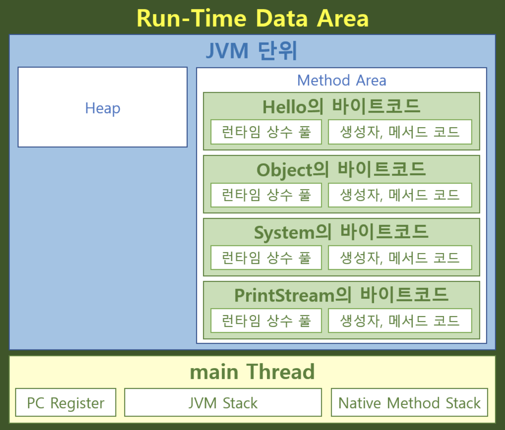

<h3>PC Register</h3>

PC 레지스터에는 현재 실행 중인 메소드가
- 네이티브 메소드가 아니면 현재 실행 중인 JVM 명령어의 위치가 저장되고
- 네이티브 메소드이면 PC 레지스터에 저장되는 값은 정의되지 않은 값(Undefined)이다.

<h3>JVM 스택은 LIFO(Last In First Out) 방식으로 동작하는 자료구조로서 JVM 스택에는 프레임이 저장된다.</h3>

<h4>Frame</h4>

JVM 스택에 쌓이는 정보의 단위가 프레임(Frame)이다. 프레임은 데이터나 중간 결과의 저장, 값 반환, 예외 디스패치에 사용된다.

**메소드 하나가 호출될 때마다 새 프레임이 생성되어 스택에 쌓이고, 메소드 호출이 정상 완료되거나 예외가 던져지면 프레임은 스택에서 빠지면서 소멸된다.**
 
 
<strong>프레임은 로컬 변수 배열, 오퍼랜드 스택, 프레임에 해당하는 메소드가 속한 클래스의 런타임 상수 풀에 대한 참조 3개의 자료구조로 구성된다.</strong>

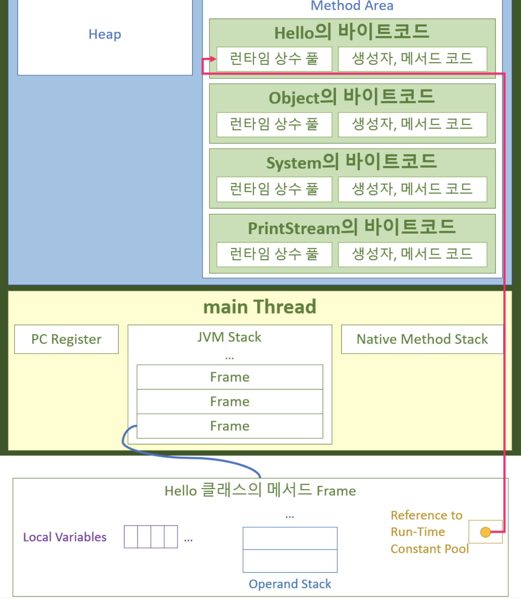

<h5>Local Variables</h5>
프레임은 로컬 변수 배열(Local Variables)을 하나 가지고 있다. 로컬 변수 배열의 크기는 컴파일 타임에 결정되며 바이트 코드의 Code 속성에 locals로 표시된다.
 
 

boolean, byte, char, short, int, float, reference, returnAddress는 1개의 슬롯에 저장되고, long, double은 2개의 슬롯에 걸쳐 저장된다.
 
 

메소드가 호출될 때 <strong>그 메소드의 파라미터 값은 로컬 변수 배열을 통해 넘겨진다.</strong>
- 메소드가 <strong>클래스 메소드이면 첫 번째 파라미터는 0번째 슬롯에 두 번째 파라미터는 1번 슬롯에 차례대로 저장되고,</strong>
- <strong>메소드가 인스턴스 메소드이면 this가 0번 슬롯에 먼저 저장되고, 첫 번째 파라미터는 1번 슬롯에, 두 번째 파라미터는 2번 슬롯에 차례대로 저장된다.</strong>

 
 

**파이썬은 인스턴스 메소드 호출 시 첫 인자로 self를 항상 넘겨주는데, 자바에서는 소스 코드에 직접 명시하지 않아도 컴파일러가 바이트코드를 생성할 때 this에 대한 심볼릭 참조를 로컬 변수 배열의 0번 슬롯에 넘겨준다.**

~~~
public homo.efficio.jvm.sample.Hell();
    descriptor: ()V
    flags: (0x0001) ACC_PUBLIC
    Code:
        stack=1, locals=1, args_size=1
            0: aload_0
            1: invokespecial #1  // Method java/lang/Object."<init>":()V
            4: return
        LineNumberTable:
            line 3: 0
        LocalVariableTable:
            Start Length Slot Name Signature
                0      5    0 this Lhomo/efficio/jvm/sample/Hello;
~~~

<h5>Operand Stack</h5>

<strong>프레임은 오퍼랜드 스택(Operand Stack)을 하나 가지고 있다.</strong> 오퍼랜드 스택의 최대 깊이는 컴파일 타임에 결정되며 바이트코드의 Code 속성에 stack으로 표시된다.
 
오퍼랜드 스택은 프레임이 생성될 때는 비어있다. 오퍼랜드 스택에 상수, 로컬 변수, 필드를 쌓는 명령어와 오퍼랜드 스택에서 값을 꺼내어 연산을 하고 다시 스택에 넣는 명령어는 JVM 명령어로 제공된다. 메소드에 전달되는 파라미터를 준비하거나 메소드가 반환해주는 결과값을 받을 때도 오퍼랜드 스택이 사용되며 단순하게 표현하면 값을 가져오고 넘겨주는 거의 모든 과정에서 오퍼랜드 스택이 사용된다고 볼 수 있다.
 

<h5>Reference to Run-Time Constant Pool</h5>
런타임 상수 풀에 대한 참조는 말 그대로 <strong>해당 프레임에 대응되는 메소드가 속한 클래스의 런타임 상수 풀에 대한 참조를 의미한다.</strong> 하나의 스레드에서 여러 인스턴스의 메소드를 실행할 수 있고, 그때마다 프레임이 생성되어 JVM 스택에 쌓이고, <strong>프레임에서 해당 클래스의 런타임 상수 풀에 있는 정보를 사용하려면 이 참조가 있어야한다. 프레임에 따라 각각 다른 클래스의 런타임 상수 풀을 가진다.</strong>

<h3>Native Method Stack</h3>
네이티브 메소드 스택(Native Method Stack)은 JVM 스택이 아닌 보통 C스택이라 부르는 전통적인 스택이며, 자바가 아닌 다른 언어로 작성된 네이티브 메소드를 지원하기위해 사용되는 스택이다. 네이티브 스택은 JVM 스택과 마찬가지로 스레드 단위의 자료구조다.

<h3>main 메소드 호출</h3>

~~~
public static void main(java.lang.String[]);
    descriptor: (Ljava/lang/String;)V
    flags: (0x0009) ACC_PUBLIC, ACC_STATIC
    Code:
        stack=2, locals=2, args_size=1
            0: New            #2 // homo/efficio/jvm/sample/Hello
            3: dup
            4: invokespecial  #3 // Method "<init>":()V
            7: astore_1
            8: getstatic      #4
            11: aload_1
            12: invokevirtual #5 // Method helloMessage():Ljava/lang/String
            15: invokevirtual #5 //Method java/io/PrintStream.println:(Ljava/lang/String;)V
            18: goto          18
        LineNumberTable:
            line 6: 0
            line 7: 8
            line 8: 18
        LocalVariableTable:
            Start   Length  Slot    Name    Signature
                0       21     0    args    [Ljava/lang/String;
                8       12     1    hello   Lhomo/efficio/jvm/sample/Hello;
        StackMapTable: number_of_entries = 1
            frame_type = 252
                offset_delta = 18
                locals = [class homo/efficio/jvm/sample/Hello]
~~~

오퍼랜드 스택의 최대 크기는 2, 로컬 변수의 크기는 2, 인자 갯수는 1이다.
 
main 메소드가 호출되면 다음과 같이 main 메소드 프레임이 생성된다. 오퍼랜드 스택과 로컬 변수 배열은 비어있는 상태고, 런타임 상수 풀에 대한 참조는 Hello 클래스의 런타임 상수풀을 가리킨다.
 
오퍼랜드 스택은 최대 크기가 2이고 아직 아무 것도 쌓여있지 않은 상태이므로 점선으로 표시했고, 로컬 변수 배열은 안에 값은 없지만 2개의 슬롯이 확정적으로 만들어져있으므로 실선으로 표시했다.

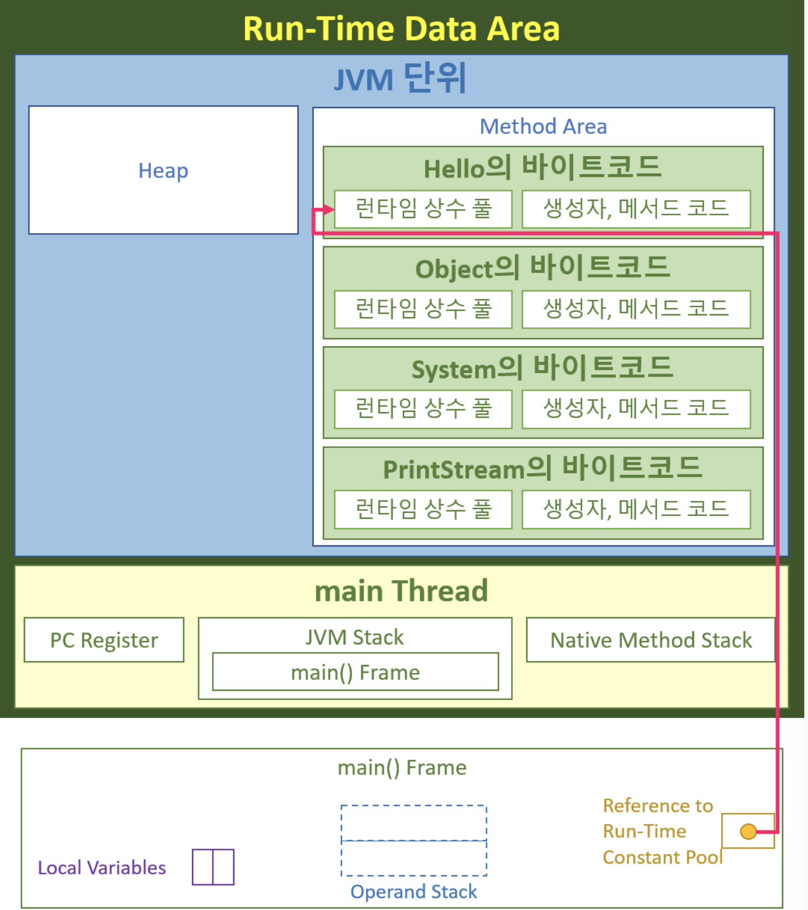

~~~
0: new #2 class homo/efficio/jvm/sample/Hello
~~~

new는 인자로 지정된 클래스의 새 인스턴스에 필요한 메모리를 힙 안에 할당하고, 할당된 위치를 가리키는 참조를 오퍼랜드 스택에 쌓는다. 이 때 인스턴스 변수들이 기본값으로 초기화된다. 참고로 인스턴스 변수가 아닌 정적 변수는 앞서 초기화 과정에서 이미 특정값으로 초기화되어 있는 상태다.

Hello 클래스의 새 인스턴스에 필요한 메모리를 할당하고 그 위치에 대한 참조를 오퍼랜드 스택에 쌓는다.(파란색 동그라미)

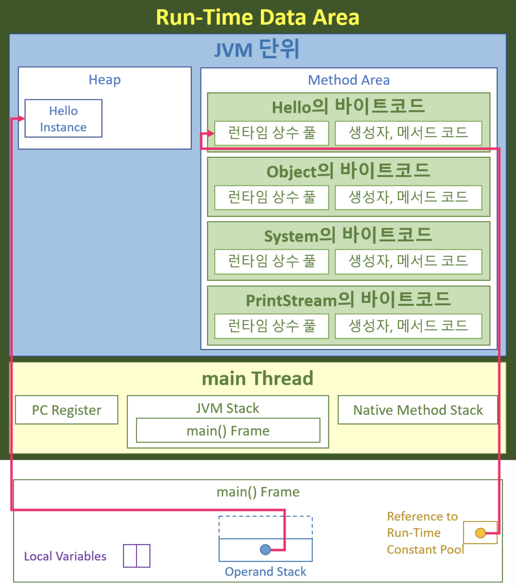

~~~
3: dup
~~~

dup는 오퍼랜드 스택 맨 위에 있는 값을 복사해서 오퍼랜드 스택 맨 위에 쌓는다(초록색 동그라미)

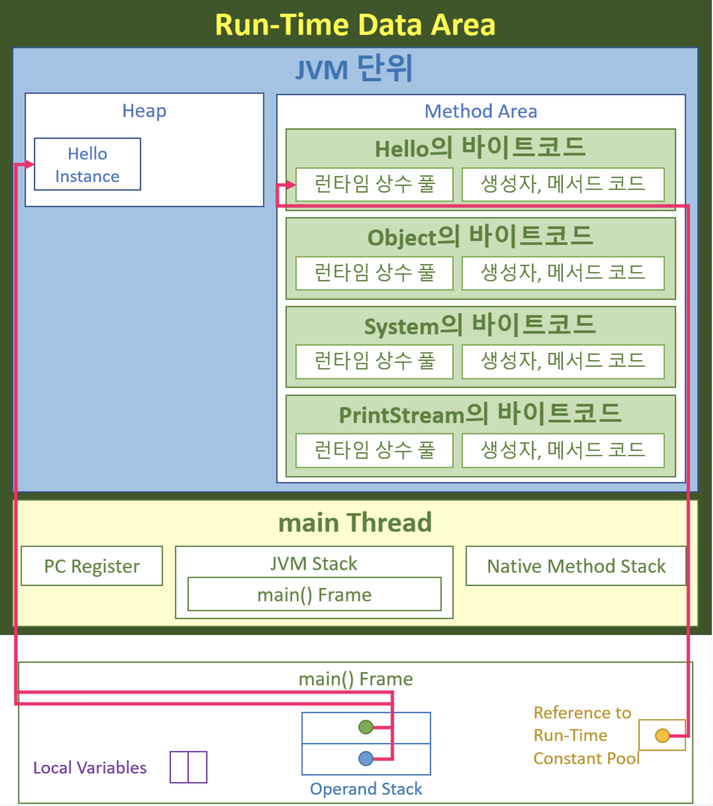

~~~
4: invokespecial #3 // Method "<init>":()V
~~~

invokespecial은 다음과 같이 생성자, 현재 클래스, 수퍼클래스의 메소드를 호출한다고 나와 있다.
 
 

그래서 private 메소드를 invokespecial이 사용된다고 써있는 자료도 흔히 볼 수 있는데, 막상 javac, javap로 확인해보면 현실은 좀 다르다. 대부분 생성자와 수퍼클래스의 생성자를 호출할 때 invokespecial이 사용되고, 상속받는 클래스에서 수퍼클래스의 메소드를 호출할 때와, 같은 클래스 내의 다른 private 인스턴스를 호출할 때는 invokevirtual이 사용된다.

 
 
invokespecial로 특정 메소드가 호출되면 프레임과 로컬 변수 배열, 오퍼랜드 스택, 런타임 상수 풀에 대한 참조가 생겨난다. 호출하는 쪽의 오퍼랜드 스택에서 호출되는 메소드의 파라미터 갯수 + 1개 만큼 호출하는 쪽의 오퍼랜드 스택에서 값을 꺼내서 호출되는 쪽에 새로 생성된 로컬 변수 배열의 0번 슬롯까지 채워지도록 뒤에서부터 차례로 채운다.

 
 
새로 호출하는 메소드의 파라미터가 2개라면 다음과 같이 진행된다.

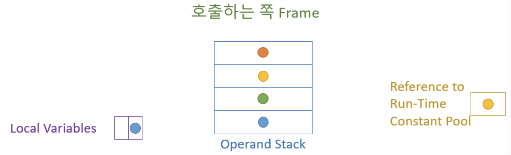

파라미터 2개 있는 메소드를 호출하면 다음과 같이 새로 프레임이 생성되고, 호출하는 쪽의 오퍼랜드 스택에서 2 + 1인 3개의 값이 차례로 꺼내져서, 호출되는 쪽의 로컬 변수 배열의 2, 1, 0번 슬롯에 차례로 저장된다.

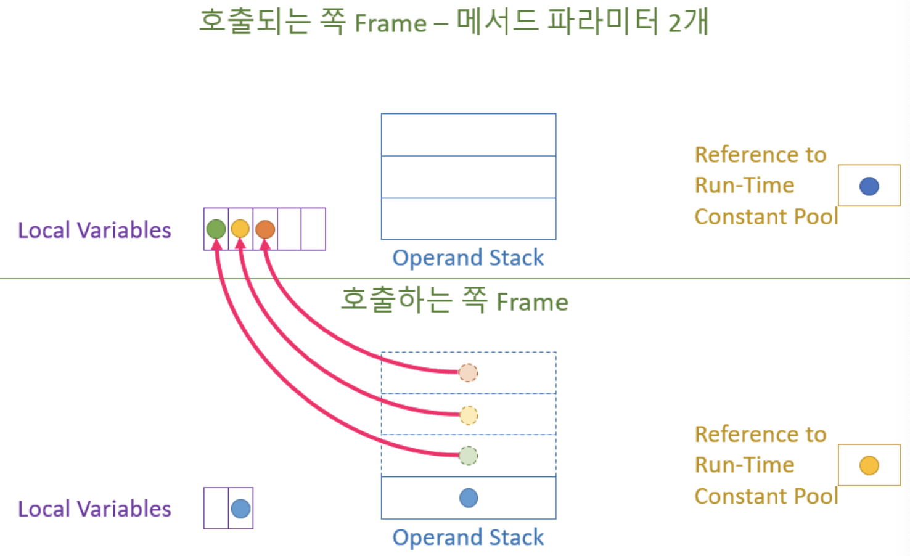

파라미터 갯수인 2개 외에 마지막에 추가로 하나 더 꺼내져서 호출되는 프레임의 로컬 변수 배열 0번 슬롯에 저장되는 값(초록색 동그라미)은 스펙에 objectref라고 표현되어 있으며 반드시 참조값이어야 한다.
 
 
지금 설명한 호출하는 쪽의 프레임의 오퍼랜드 스택에서 값을 꺼내서 호출되는 쪽의 프레임의 로컬 변수 배열에 저장하는 방식은 invokespecial뿐 아니라 invokevirtual에도 공히 적용되는 방식이다.
 
스택 맨 위에 있는 Hello 인스턴스에 대한 참조(초록색 동그라미)를 꺼내서 Hello 클래스의 디폴트 생성자의 첫 번째 인자로 넘기면서 디폴트 생성자를 호출한다. Hello클래스의 디폴트 생성자에 대한 프레임(Hello 생성자 프레임)이 새로 생성되고 JVM 스택의 맨 위(main 메소드 프레임 위)에 쌓인다. Hello 생성자 프레임 안에 있는 로컬 변수 배열의 0번 슬롯에 새 Hello 인스턴스에 대한 참조가 저장된다.

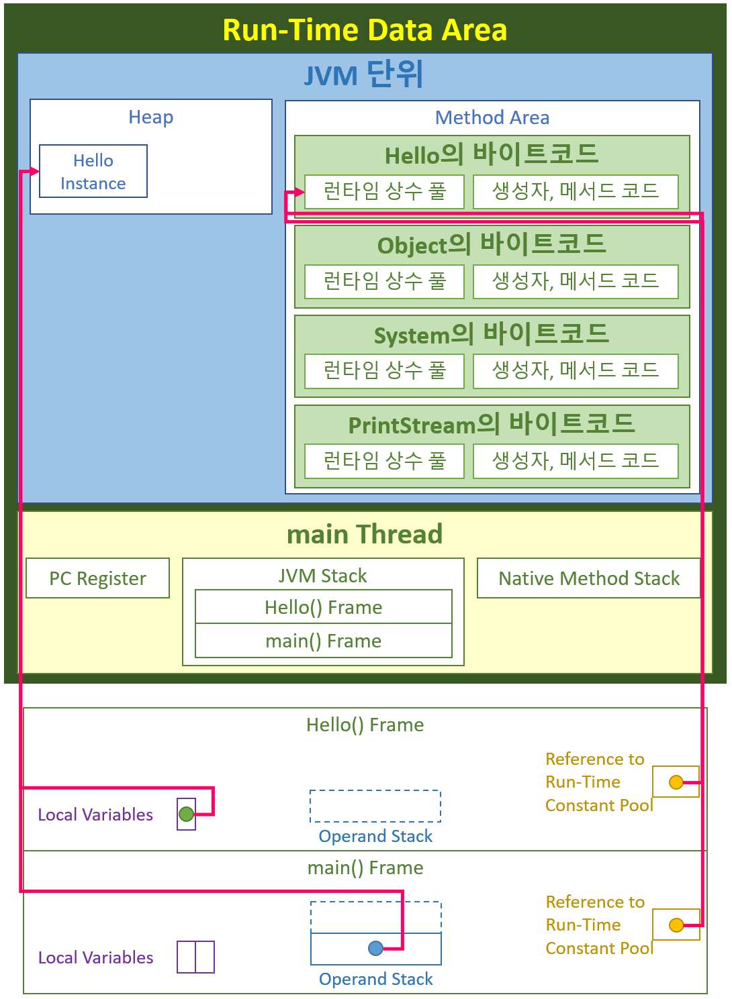

Hello 생성자의 바이트코드는 다음과 같다.

~~~
public homo.efficio.jvm.sample.Hello();
    descriptor: ()V
    flags: (0x0001) ACC_PUBLIC
    Code:
        stack=1, locals=1, args_size=1
            0: aload_0
            1: invokespecial    #1 // Method java/lang/Object."<init>":()V
            4: return
        LineNumberTable:
            line 3: 0
        LocalVariableTable:
            Start   Length  Slot    Name    Signature
                0        5     0    this    Lhomo/efficio/jvm/sample/Hello;
~~~

Code 속성 바로 아래줄에 stack=1, locals=1, args_size=1라고 되어 있는데, Hello 생성자 프레임의 오퍼랜드 스택 최대 깊이는 1, 로컬 변수 배열의 크기는 1, 인자의 갯수는 1개로 되어있다. 오퍼랜드 스택 최대 깊이와 로컬 변수 배열의 크기는 위 그림에 적용되어 있다.

Hello 생성자 프레임이 생성되면 가장 위에 있는 명령어인 aload_0이 먼저 실행된다.

~~~
0: aload_0
~~~

aload_n 은 로컬 변수 배열의 n번 슬롯에 저장된 참조값(load앞에 붙은 a가 참조값을 의미)을 오퍼랜드 스택 맨 위에 쌓는다.
 
 
Hello 생성자 프레임의 로컬 변수 배열의 0번 슬롯에 저장되어 있던 새 Hello 인스턴스에 대한 참조(초록색 동그라미)가 Hello 생성자 프레임의 오퍼랜드 스택에 쌓인다.

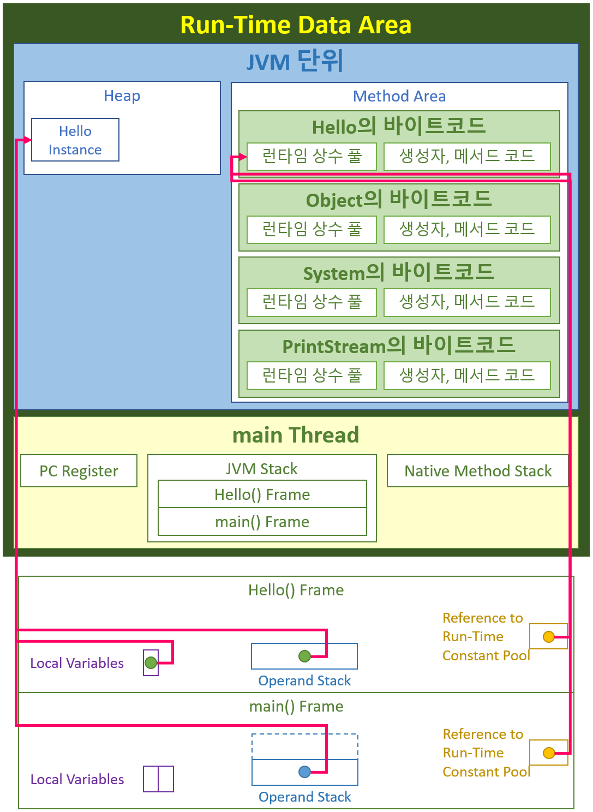

~~~
1: invokespecial #1     // Method java/lang/Object."<init>":()V
~~~

Object의 생성자를 호출하면 힙에 Object의 새 인스턴스를 위한 메모리가 할당되고, Object 생성자 프레임이 생성된다. Hello 생성자 프레임의 오퍼랜드 스택 맨 위에 있던 this(초록색 동그라미)가 꺼내지고 새로 생성된 Object 생성자 프렝미의 로컬 변수 배열의 0번 슬롯에 저장(초록색 동그라미)가 된다.

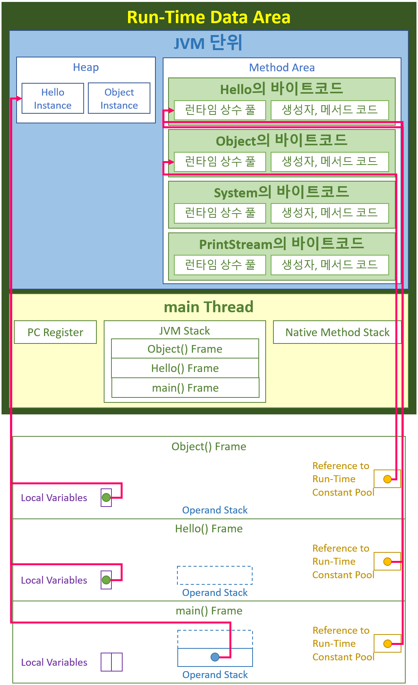

Object의 생성자 바이트 코드는 다음과 같다.

-----------------

javap -v -p -s java.lang.Object

-----------------

~~~
public java.lang.Object();
    descriptor: ()V
    flags: (0x0001) ACC_PUBLIC
    Code:
        stack=0, locals=1, args_size=1
            0: return
        LineNumberTable:
            line 50: 0
        LocalVariableTable:
            Start   Length  Slot    Name    Signature
                0        1     0    this    Ljava/lang/Object;
        RuntimeVisibleAnnotations:
            0: #27()
                jdk.internal.HotSpotIntrinsicCandidate
~~~

return은 void 반환하며, 오퍼랜드 스택에 있던 모든 값이 전부 폐기되고 Object 생성자 프레임도 폐기되고, 호출한 메소드의 프레임인 Hello 생성자 프레임으로 제어가 넘어간다.

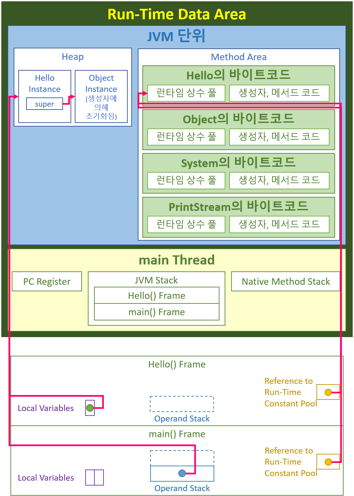

Hello의 디폴트 생성자의 바이트코드에서 남은 것은 return뿐이다. 따라서 Hello의 디폴트 생성자 실행이 완료되면 Hello 생성자 프레임도 폐기되고 다음과 같이 main 메소드 프레임의 오퍼랜드 스택에는 아래와 같이 새로 생성 및 초기화 Hello 인스턴스에 대한 참조만 남게된다.

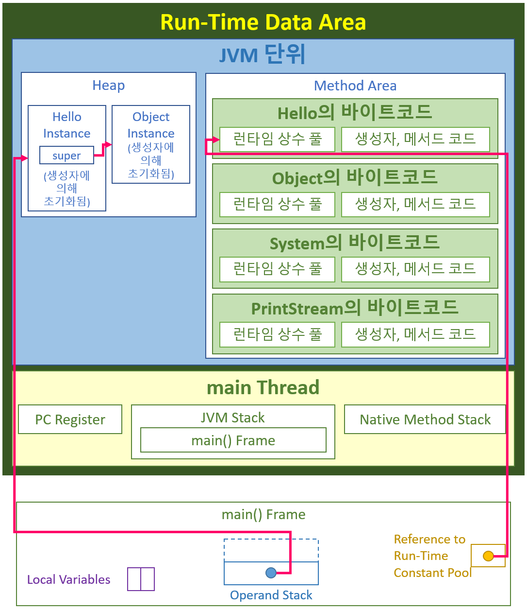

---------------------

7: astore_1

---------------------

astore_n은 오퍼랜드 스택의 맨 위에 있는 값을 꺼내서 로컬 변수 배열 n 위치에 저장한다.
현재 main 메소드 프레임의 오퍼랜드 스택 맨 위에 있는 값인 새 Hello 인스턴스에 대한 참조(this)를 꺼내서 main 메소드 프레임의 로컬 변수 배열의 1번 슬롯에 넣는다.
 
<strong>결국 로컬 변수에 뭔가 저장하는 것인데 자바 소스 코드의 final Hello hello = new Hello();</strong>에 해당한다.

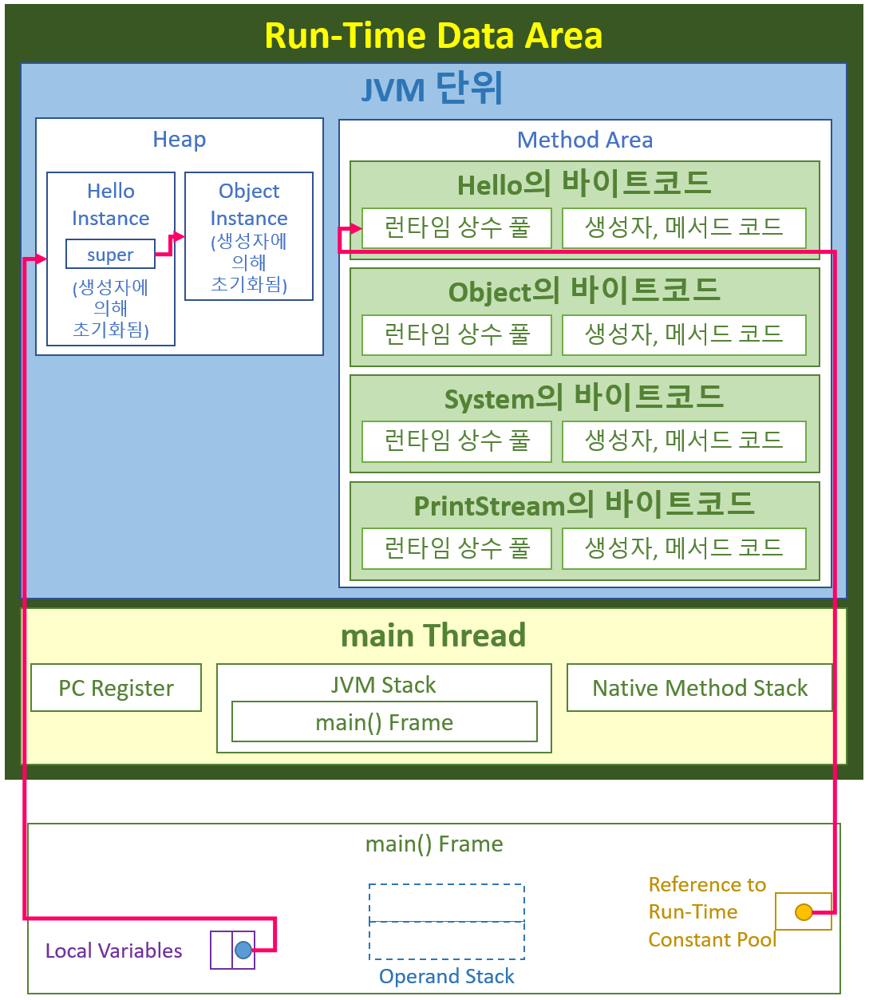

-------------

8: getstatic #4 // Field java/lang/System.out::Ljava/io/PrintStream

-------------

getstatic은 클래스의 저정(static) 필드 값을 가져와서 오퍼랜드 스택에 쌓는다. 여기에서는 System 클래스의 정적 변수인 out의 값을 System의 런타임 상수 풀에서 읽어서 main 메소드 프레임의 오퍼랜드 스택에 쌓는다.(초록색 동그라미)

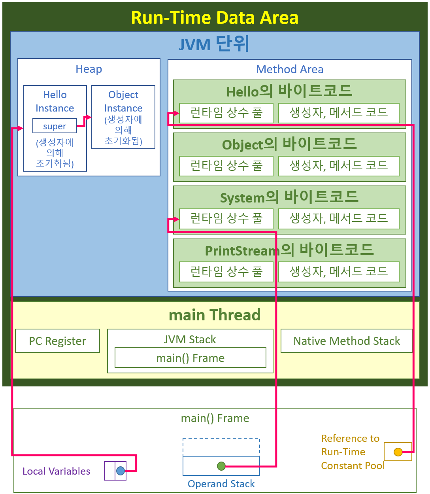

-------------

11: aload_1

-------------

aload_1은 main 메소드 프레임의 로컬 변수 배열 1번 슬롯에 있던 값을 main 메소드 프레임의 오퍼랜드 스택에 쌓는다.

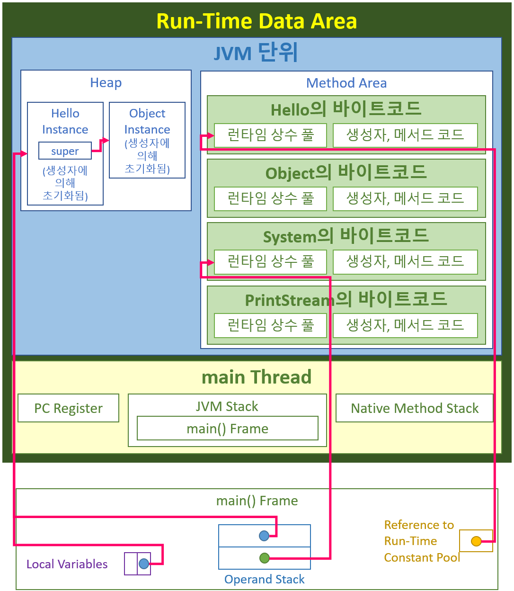

-------------

12: invokevirtual #5 // Method helloMessage:()Ljava/lang/String;

-------------

invokevirtual은 자바 메소드 호출의 기본 방식이며, 객체 참조(.obj)를 붙여서 호출되는 일반적인 메소드를 호출한다. 해당 메소드가 속한 인스턴스를 가리키는 참조가 첫 번째 파라미터로 넘겨진다. 호출에 의해 새 프레임이 생성되고 로컬 변수 배열의 0번 슬롯에 첫 번째 인자로 넘어온 값인 해당 메소드가 속한 인스턴스를 가리키는 참조값이 저장되고 그 후의 인자도 로컬 변수 배열에 순서대로 저장된다. 앞에서 invokespecial에 나왔던 그림 설명을 참고한다.
 
 

~~~
public java.lang.String helloMessage();
    descriptor: ()Ljava/lang/String;
    flags: (0x0001) ACC_PUBLIC
    Code:
        stack=1, locals=1, args_size=1
            0: ldc      #7      // String Hello, JVM
            2: areturn
        LineNumberTable:
            line 12: 0
        LocalVariableTable:
            Start   Length  Slot    Name    Signature
                0        3     0    this    Lhomo/efficio/jvm/sample/Hello;
~~~

helloMessage()가 호출되면 helloMessage 메소드 프레임이 새로 생성되고, main 메소드 프레임의 오퍼랜드 스택 맨 위에 있던 값(파란 동그라미)이 꺼내져서 helloMessage 메소드 프레임의 로컬 변수 배열 0번 슬롯에 저장된다.

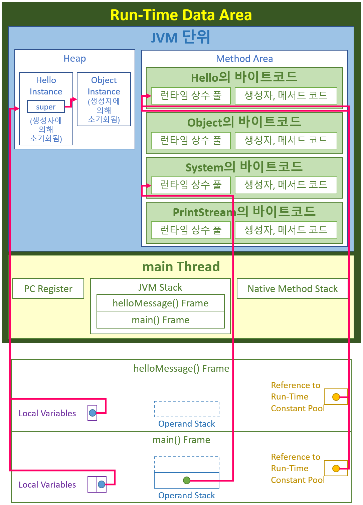

-------------

0: ldc #7   // String Hello, JVM

-------------

ldc는 런타임 상수 풀의 항목 하나를 오퍼랜드 스택의 맨 위에 쌓는다.
Hello 클래스의 런타임 상수 풀의 7번 항목인 문자열 리터럴 "Hello, JVM"에 대한 참조를 helloMessage 메소드 프레임의 오퍼랜드 스택 맨 위에 쌓는다. 문자열 풀은 Java6까지는 힙이 아닌 PermGen 영역에 있었지만, Java7부터 힙에 존재한다고 한다.
따라서 스펙에서 확인한 내용은 아니지만 Java11에서도 문자열 풀은 힙에 존재한다고 보면 다음과 같이 표현할 수 있다.

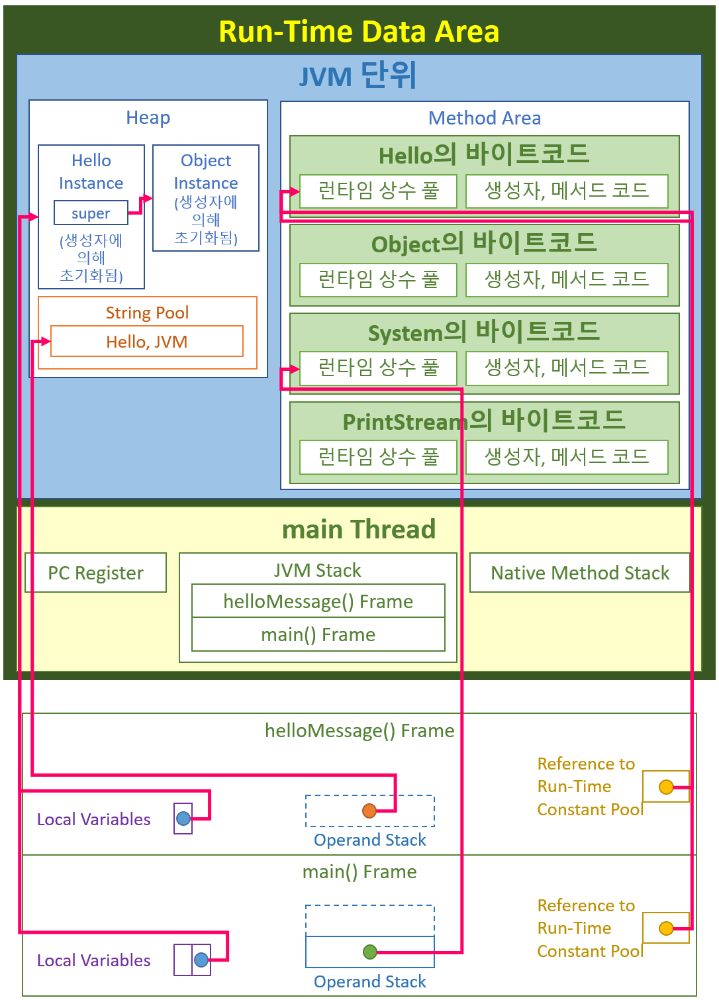

-------------

2: areturn

-------------

areturn은 오퍼랜드 스택 맨 위에 있는 참조값(return 앞에 있는 a가 참조값을 의미)를 꺼내서 호출하 ㄴ메소드 프레임의 오퍼랜드 스택 맨 위에 저장하고, areturn이 속한 프레임을 폐기하고 제어를 호출한 메소드 프레임으로 넘겨준다.
 
 
helloMessage 메소드 프레임의 오퍼랜드 스택 맨 위에 있던 값은 "Hello, JVM"에 대한 참조이며 이 값을 main 메소드 프레임의 오퍼랜드 스택 맨 위에 쌓는다. <strong>결국 메소드가 값을 반환한다는 것은 호출된 프레임의 오퍼랜드 스택 맨 위의 값을 꺼내서 호출한 프레임의 오퍼랜드 스택 맨 위에 저장하는 것을 의미한다.</strong>

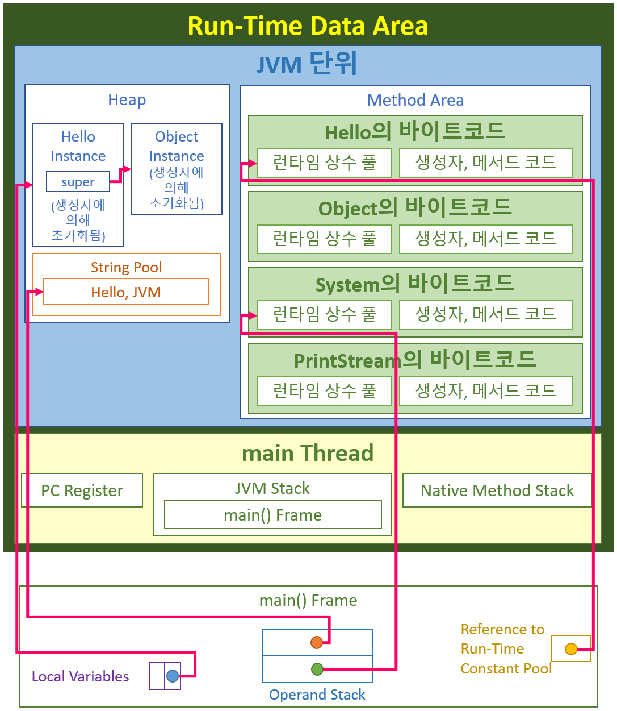

-------------

15: invokevirtual   #6 //Method java/io/PrintStream.println(Ljava/lang/String;)V

-------------

main 메소드 프레임의 오퍼랜드 스택에 있던 System.out에 대한 참조와 "Hello, JVM"에 대한 참조는 invokevirtual로 System.out.println(String)을 호출하면서 모두 꺼내지고 main메소드 프레임의 오퍼랜드 스택은 비워진다. println 메소드 프레임이 새로 생성되고 인자로 전달받은 참조를 활용해서 "Hello, JVM"을 화면에 출력하고, println 메소드 프레임은 폐기된 후의 모습은 다음과 같다.

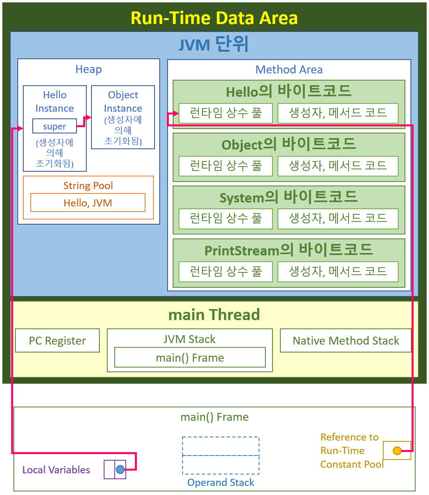

-------------

18: goto 18

-------------

goto는 오퍼랜드 스택의 변화 없이 특정 행으로 실행 흐름을 이동시킨다.

18행에서 18행으로 계속 이동하면 결국 무한루프다. 자바 코드의 while(true){}가 여기에 해당한다.

<h2>정리</h2>

1. JVM이 실행되는 프로그램(class)파일을 실행하면 JVM이 기동한다.
2. JVM이 기동되면 Heap, Method Area가 생성된다.
3. 프로그램 실행에 필요한 시작 클래스의 바이트코드가 클래스로더를 통해 로딩되어 메소드 영역에 저장된다. 이떄 바이트 코드에 있던 상수 풀의 내용을 바탕으로 런타임 상수 풀이 클래스 단위로 만들어져 메소드 영역에 함께 저장된다.
4. 링크(verify, prepare, resolve)를 통해 Object 등 프로그램 실행에 필요한 다른 클래스들이 로딩되고 필요하다면 정적으로 초기화된다.
5. 시작 클래스의 main 메소드 실행을 위한 main 스레드가 생성한다.
6. main 스레드가 생성되면 PC Register, JVM Stack, Native Method Stack이 한 개씩 main 스레드에 생성된다.
7. JVM 스택이 생성되면 main 메소드를 위한 main 메소드 프레임이 생성된다.
8. main 메소드 프레임이 생성되면 로컬 변수 배열, 오퍼랜드 스택, 런타임 상수 풀에 대한 참조가 한 개씩 main 메소드 프레임에 생성된다.
9. main 메소드의 내용에 따라 Local Variable Array, Operand Stack, Runtime Constant Pool에 대한 참조가 포함된 새 프레임이 생성되어 JVM Stack 위에 쌓이고, 메소드 호출이 종료되면 해당 프레임이 JVM 스택에서 빠져나가고 제어는 다시 호출한 메소드의 프레임으로 돌아온다. 이때 반환값이 있다면 호출한 메소드의 프레임의 오퍼랜드 스택의 맨 위에 쌓인다.

그림으로 보면 아래와 같다.

