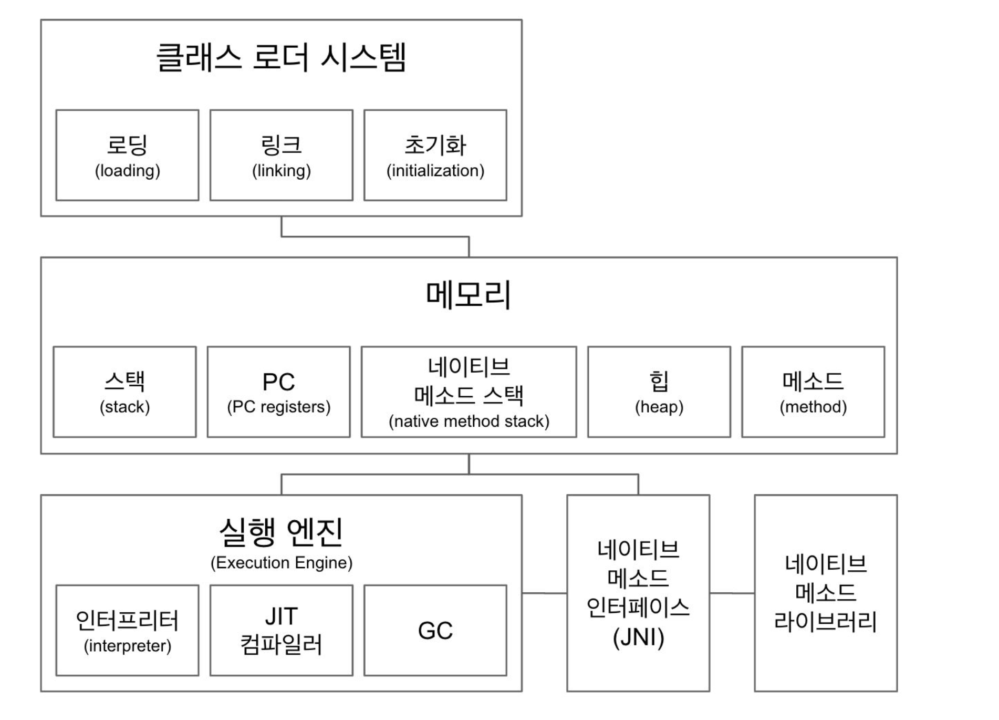
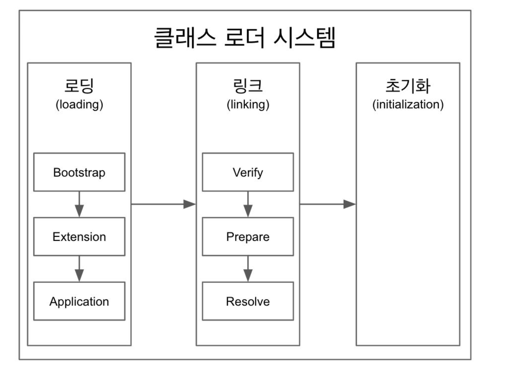
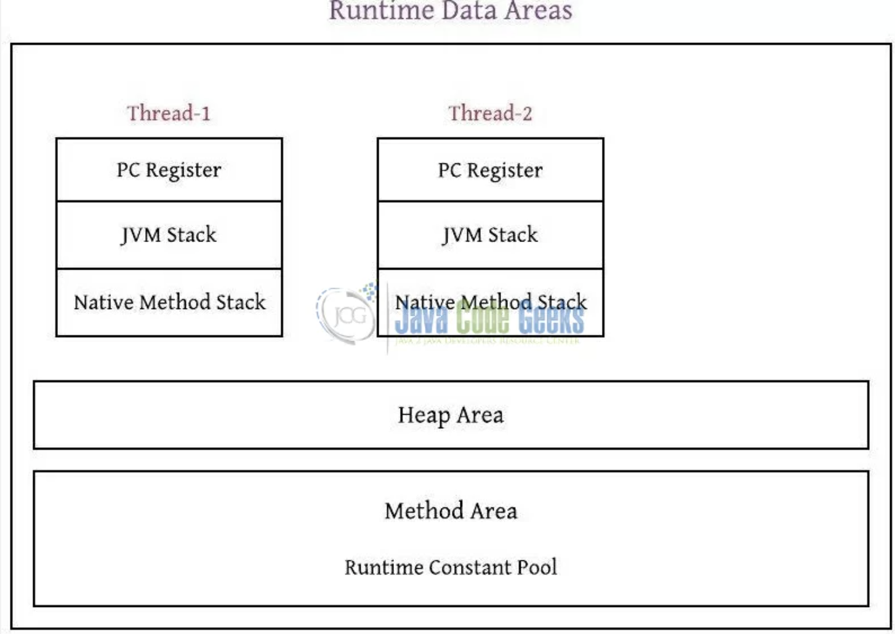
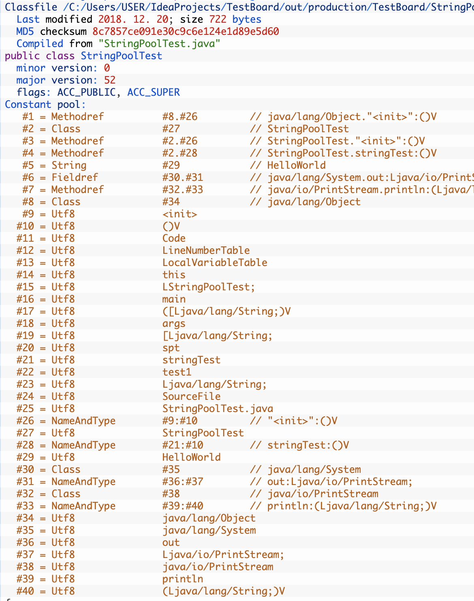

<h1>JVM 구조</h1>

프로그램이 실행되면, JVM은 OS로부터 메모리를 할당받고, JVM은 이 메모리를 용도에 따라 여러 영역으로 나눠서 관리한다.

- Class Loader System: 클래스 파일을 로딩한 뒤 검증하고 초기화하는 영역
- Runtime Data Area: Method Area, Heap, Java stack, pr registers, native method stacks 5개 영역으로 나뉜다.
- Execution Engine: 클레스 파일을(바이트 코드) 플랫폼에 맞게 기계어로 변환시켜 실행하는 Execution engine

<h2>Class Loader</h2>

- 로딩, 링킹, 초기화 순으로 진행된다.
  1. 로딩
   - 클래스 로더가 .class 파일(class, interface, enum)을 읽고 그 내용에 따라 적절한 바이너리 데이터를 만들고 "메소드"영역에 저장.
   - 이때 메소드 영역에 저장하는 데이터
     - FQCN(Fully Qualified Class Name)
     - 부모 클래스 이름
     - 생성자
     - 메소드와 변수
   - <strong>메소드 영역에 저장되자마자 JVM이 즉시 해당 클래스에 대한 java.lang.class 타입의 객체를 힙 영역에 만든다.</strong> 이 과정은 한번만 수행된다.
   - 링크
     - Verify, Prepare, Resolve(Optional) 세 단계로 나뉜다.
       - Verify: .class파일 형식이 유효한지 체크한다. 유효하지 않다면 VerifyError을 반환한다.
       - Preparation: 클래스 변수(static 변수)와 기본값에 필요한 메모리를 할당한다.
       - Resolve: 심블록 메모리 레퍼런스를 메소드 영역에 있는 실제 레퍼런스로 교체한다.
   - 초기화
     - 클래스 로딩 과정의 마지막이며, static 변수의 값을 할당하고 static 블록을 실행한다.

- 클래스 로더는 계층 구조로 이뤄져 있으며, 기본적으로 세가지 클래스 로더가 제공된다.
  - 부트 스트랩 클래스 로더: 코어 자바 API를 제공한다. 최상위 우선순위를 가진 클래스 로더이며, 모든 JVM에서 디폴트로 사용한다. C/C++로 작성됐으며, 부트스트랩 클래스 로더에서 getClassLoader()를 호출하면 null이 반환된다.
  - 플랫폼 클래스 로더: 부트 스트랩 클래스로더 하위에 있는 클래스 로더이며, extension classpath(i.e. jdk\jre\lib\ext)에 있는 클래스들은 로딩한다. C/C++이 아닌 Java로 작성된 클래스 로더이다.
  - 애플리케이션 클래스로더: 애플리케이션 클래스패스(애플리케이션 실행할 때 주는 -classpath 옵션 또는 java.class.path 환경 변수의 값에 해당하는 위치)에서 클래스를 읽는다.

<h3>왜 클래스 로더는 계층적인가?</h3>
<strong>

  - 클래스 로더마다 다른 방식의 클래스 로딩 방식을 갖을 수 있다.
  - A 클래스 로더는 서버로부터 특정 클래스를 위한 바이트코드를 가져온 뒤 JVM의 메소드 영역에 저장한다.
  - B 클래스 로더는 특정 파일의 바이트 코드를 읽지 않고 요구에 따라 바이트코드를 만들어 낸다.(cglib)
  
</strong>

<h3>클래스 로더의 세 가지 원칙</h3>

<h4>Delegation</h4>
  
1. JVM이 클래스를 만나면 해당 '.class' 파일이 로딩되었는지 확인한다.
2. 해당 '.class' 파일이 이미 메소드 영역에 로딩되었다면 해당 클래스를 처리하고, 로딩되있지 않다면, JVM이 클래스 로더에게 로딩을 요청한다.
   1. 클래스 로더 시스템이 JVM의 요청을 Application classloader에게 넘긴다. Application classloader는 다시 extension classloader에게 요청을 넘기고, 마지막으로 extension classloader는 bootstrap classloader에게 요청을 넘긴다.
   2. bootstrap classloader가 해당 클래스 파일을 부트스트랩 클래스 패스(i.e. jdk\jre\lib\rt.jar)에서 찾고 있으면 해당 '.class'파일을 로딩한다.
   3. 없다면 bootstrap classloader는 요청을 extension classloader로 다시 넘긴다. extension classloader는 클래스를 다시 jdk\jre\lib\ext에서 찾고, 있으면 해당 '.class'파일을 로딩한다.
   4. 없다면 extension classloader는 요청을 application classloader로 넘긴다. 찾으면 로딩하고, 못찾으면 ClassNotFoundException을 반환한다.

<h4>Visibility</h4>

application classloader는 부모 클래스 로더에 대해 가시성을 갖지만, 역은 성립하지 않는다. 즉 application classloader에 의해 로딩된 클래스를 이 후에 extension classloader를 사용해서 다시 로딩하려고하면 ClassNotFoundException이 발생한다.

<h4>Uniqueness</h4>

부모 클래스 로더에 의해 로딩된 클래스는 자식 클래스 로더에 의해 다시 로딩되지 않아야한다.

- Static class loading: new 연산자를 통해 로딩된다. 로딩한 이후에 객체를 초기화한다.
- Dynamic class loading: Class.forName(), loadclass() 메소드 등을 이용해서 프로그래밍적으로 로딩된다. 로딩만할 뿐 객체를 초기화하지 않는다.

 

<strong>대부분의 클래스는 애플리케이션 클래스 로더가 로딩한다. 애플리케이션 클래스 로더는 플랫폼 클래스 로더가 로딩하고, 플랫폼 클래스 로더는 부트스트랩 클래스로더가 로딩하고, 부트스트랩 클래스 로더는 java 명령에 의해 JRE가 조성될 때 실행된다.</strong>

<h2>Execution Engine</h2>

<strong>Laod된 Class의 ByteCode를 실행하는 Runtime Module이 바로 Execution Engine이다. Class Loader를 통해 JVM 내의 Runtime Data Areas에 배치된 바이트 코드는 Execution Engine에 의해 실행된다. 실행 엔진은 자바 바이트 코드를 명령어 단위로 읽어서 실행한다.</strong> 최초 JVM이 나왔을 당시에는 Interpreter 방식이어서 속도가 느렸지만 JIT Compiler 방식을 도입해서 이 점을 보완했다. JIT는 ByteCode를 어셈블러 같은 Native Code로 바꿔서 실행이 빠르지만 이 역시 변환하는데 비용이 발생했고, 이 같은 이유로 JVM은 모든 코드를 JIT Compiler 방식으로 실행하지 않고 Interpreter 방식을 사용하다가 일정한 기준이 넘어가면 JIT Compiler 방식으로 실행한다.

1. Interpreter: 자바 바이트 코드를 명령어 단위로 읽어서 실행한다. 이 방식은 한줄 씩 수행하기 때문에 느리다는 단점이 있다.
2. JIT(Just In Time): 인터프리터의 단점을 보완하기 위해 도입한 됐다. 인터프리터 방식으로 실행하다가 적절한 시점에 바이트 코드 전체를 컴파일 하여 네이티브 코드로 변경해서 저장하고, 재사용 할 때 변환된 네이티브 코드를 재사용하는 방식. 초반에 메모리를 잡아 두거나 하는 작업들이 있어서 초기 실행속도는 느릴 수 있지만 이후로는 ByteCode를 사용할 때마다 네이티브 코드로 변환하는 작업이 들어 실행속도가 많이 향상된다.

<h2>Runtime Data Area</h2>

JVM이 프로그램을 수행하기 위해 OS로부터 별도로 할당받는 메모리 공간

1. <strong>PC Register:</strong> Thread마다 할당되는 공간이다. Thread가 어떤 명령을 실행해야할지를 기록하는 부분으로 현재 수행중인 JVM명령의 주소를 갖는다. 만약 Native Method를 수행한다면 PC Register는 undefined 상태가 된다. PC Register에 저장되는 Instruction의 주소는 Native Pointer일 수도 있고 Method ByteCode일수도 있다. Native Method를 수행한다면 JVM을 거치지 않고 API를 통해 바로 수행된다.

2. <strong>JVM stack:</strong> 스레드마다 하나씩 할당되며 지역 변수를 저장하는 곳이다. 공유 자원이 아니므로 thread-safe하며, 스레드 실행이 완료되면 제거된다. 다음 세 가지 영역으로 나눌 수 있다.
   - Local variable array: VM이 메소드 호출시에 파라미터를 전달하기 위해서 사용된다.
   - Operand Stack: 메소드 실행 중에 실제로 연산을 실행하게 되는 부분이다.(레지스터 기반이 아닌 스택 기반으로 연산한다.) <strong>VM이 Operand stack에서 데이터를 꺼내서 연산을 수행한 뒤 그 결과를 다시 Operand stack에 넣는다.</strong> 또한 메소드를 호출할 때 넘기기 위한 파라미터를 여기서 준비하며, 메소드 호출의 결과도 저장된다.

3. <strong>Native Method Stack:</strong> Java외의 언어로 작성된 네이티브 코드들을 위한 Stack, 즉 JNI(Java Native Interface)를 통해 호출되는 C/C++등의 코드를 수행하기 위한 스택. 실제 실행할 수 있는 기계어로 작성된 프로그램을 실행시키는 영역이다.

4. <strong>Method Area(=Class Area = Static Area):</strong> 모든 스레드가 공유하는 영역. 
**클래스, 인터페이스, 메소드, 필드, static 변수 등의 바이트 코드 등을 보관한다.** 자바 프로그램은 main 메소드의 호출에서부터 계속된 메소드의 호출로 흐름을 이어가며, 대부분 인스턴스의 생성도 메소드 내에서 명령하고 호출한다. 사실상 컴파일된 바이트코드의 대부분이 메소드 바이트코드이기 때문에 거의 모든 바이트코드가 올라간다고 봐도 무방하다. <strong>이 공간에는 Runtime Constant Pool이라는 별도의 관리 영역도 함께 존재한다. 이는 상수 자료형을 저장하여 참조하고 중복을 막는 역할을 수행한다.</strong> JVM당 하나의 메소드 영역이 존재하며 모든 클래스들에 의해 공유된다.

<h3>Method Area에 올라가는 정보의 종류</h3>

*Method area는 이론적으로 힙의 영역 중 일부이다.*

1. Field Information: 멤버 변수의 이름, 데이터 타입, 접근 제어자에 대한 정보
2. Method Information: 메소드의 이름, 리턴 타입, 매개변수 타입, 접근 제어자에 대한 정보
3. Type Information: Type 속성이 Class인지, Interface인지 여부 저장
   - FQCN
   - Type의 Super Class FQCN
   - 접근 제어자 및 연관된 Interface의 전체 리스트 저장
4. Constant Pool
   - Type에서 사용된 상수를 저장하는 곳(중복이 있을 시 기존의 상수 사용)
   - 문자 상수, 타입, 필드, Method의 Symbolic reference(객체 이름으로 참조하는 것)도 상수 풀에 저장.
5. Class variable: static 변수라고도 불림. 모든 객체가 공유할 수 있고, 객체 생성없이 접근 가능
6. JIT 컴파일러에 의해 컴파일된 코드도 여기에 저장된다.
7. Class 사용 이전에 메모리 할당. final class 변수(static final)변수의 경우 상수로 치환되어 상수풀에 복사된다.

<h2>Heap</h2>
- 객체를 저장하는 가상 메모리 공간. 프로그램 상에서 런타임시 동적으로 할당하여 사용하는 영역.

<h2>메모리 영역에 대해 헷갈리는 부분 정리</h2>

<h3>1. Permanent generation(JDK8이전)과 method area의 관계</h3>

JVM Spec은 Method area의 개념은 규정하고 있지만, 어떤식으로 구현해야할지는 규정하고 있지 않다. 따라서 JVM 구현마다 Method area 구현 방법은 다를 수 있다. 대부분 SUN사의 HotSpot JVM을 가장 많이 사용하고, HotSpot에서는 method area를 구현하기 위해 permanent generation을 사용했다. 즉 Permanent generation은 HotSpot JVM의 개념이고, Method Area는 JVM Spec의 규정(표준을 정한 것)이다. 즉 JDK 1.2~JDK 6까지 HotSpot은 Permanent한 Method area 를 제공했고 재사용 가능한(GC된 Method Area가 OS로 다시 반환되지 않는) GC 구현을 사용했다.

<h3>2. Metaspace</h3>

Java8에 들어서면서, HotSpot은 Permanent generation 영역을 버리고 Native memory 영역에 Metaspace를 만든다. 디폴트로 클래스 메타 데이터를 저장하기 위한 native memory 영역에 크기 제한은 없다. 그러면 Method area가 없는가? Method area는 스펙이므로 당연히 여전히 존재한다. 차이점은 뭔가? 
<strong>

1. 위치: Permanent generation은 heap 영역에 속하고, meta space 영역은 local memory 영역에 속한다.
2. 정보: Permanent generation 영역에서는 static 변수/object, constant pool, class meta 정보등을 모두 저장했으나, meta space에서는 class meta 정보만 저장하고, constant pool, static variable은 heap 영역에 저장된다.

</strong>

<h3>3. Constant Pool(Class file)</h3>

상수풀 테이블(Constant Pool Table)등의 컴파일된 바이트 코드 파일을 의미한다. 이는 컴파일 동안 생성된 심볼릭 참조나 리터럴을 저장하기 위한 용도이다. 클래스가 로딩된 이후에는 메소드 영역의 runtime constant pool에 저장된다.

<h3>4. Runtime Constant Pool</h3>

클래스 로더에 의해 클래스가 로딩되면, 위의 constant pool이 Method area의 runtime constant pool에 저장된다. 즉 클래스가 로딩되는 시점에 constant pool을 기반으로 동적으로 생성된다. runtime constant pool은 런타임에 symbolic reference를 리졸빙한다. 즉, 필드와 메소드명 등을 인덱싱한다. 인덱싱되면, 타입 정보 및 필드와 메소드의 이름, 디스크립터를 알 수 있다. 결과적으로 이때부터 메소드 호출이 가능해지고, 필드에 접근할 수 있게된다.

<h3>5. String constant pool</h3>

JVM마다 단 하나 존재하며 Java 8 이후로 permanent generation이 없어지면서 local memory 영역에 위치하게 된다.